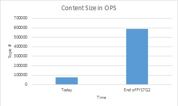

#VSC Content Service plan in FY17Q2

##Business Overview
VSC team has completed Content Service FY17Q2 planning in later September. During FY17Q2, OPS System is still the major investment area of VSC Content Service, while keeping legacy system running with necessary compliance and security updates. 

Goal of FY17Q2:
- Projects on-boarding to OPS
- Develop features to unblock major CSI projects (see below Q2 Outstanding Projects) onboarding towards OPS/DOCS for the next batch
- Performance improvement to support 500+ users working on same repo
- Usability Improvement to support self-service onboarding and resolve major pain points during content authoring/publishing/verifying

Q2 Outstanding Projects:
- Azure: 4000+ conceptual topics * 18 locales from azure.microsoft.com/documentation/articles, and 5 languages for reference topics.
- VS2017RC: 4 conceptual OPS content repo with content coming from from 5 CAPS docset, including ~24K topics in en-us. No reference doc in Nov release.
- ASP.NET: en-us only, to be migrated from docs.asp.net to DOCS.MSFT, including ~200 ASP.NET conceptual topics, 2600+ ASP.NET reference topics, <100 EF conceptual topics, and 4800+ EF reference topics.
- Dynamics Hub Page: 1 single Hub Page for 65 locales.

By end of FY17Q2, the content size in OPS system would be:

##FY17Q2 Planning Outcome
###FY17Q2 Feature List
[FY17Q2 Feature Query](https://mseng.visualstudio.com/DefaultCollection/VSChina/_workItems/index?path=Shared%20Queries%2FSprint%20Planning%2FVSC%20FY17Q2%20Planning&_a=query)

###FY17Q2 Priority Definition Table###

|Priority|Definition|High Level Scope|Commitment Status|
|---|:---|:---|:---|
|P1|Blocking features for high priority Q2 event/project (Nov release)|	`Azure on-boarding` `VS/ASP.NET onboarding` `Dynamics Hub Page`	|P1 features are committed in Q2|
|P2|Features required for Post-November release, and Features required by OPS system maturity & usability|Self-service provisioning, stability, performance, extensibility, etc|P2 features are targeting to finish in Q2 unless resource is pre-empted by higher priority churn-in requests|
|P3|Features nice to have| |P3 features are not in Q3 unless it can help Eng team|

###Process Update
Another outcome of FY17Q2 planning is about the improvement on feature and bug process.
- Regarding feature intake process, the main change is that VSC team introduces C&E internal process to intake features from CSI. For feature request coming from non-C&E, new request is still expected to come through [MSDNHelp site](http://msdnhelp.corp.microsoft.com/) then get VSC PM engaged.
- Regarding bug process, the main change is more at tooling improvement so as to reduce the turnaround time and provide better SLA to users. Bug filing are still expected to go through [MSDNHelp site](http://msdnhelp.corp.microsoft.com/) as communicated to our partners previously, and we'll keep training users to enforce this process in FY17Q2.

