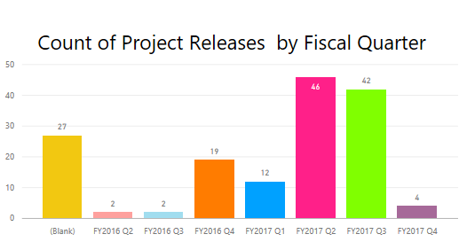

#VSC Content Service plan in FY17Q3

##Project Overview
In FY17Q3, the total number of OPS onboarding projects is 42 (very close to FY17Q2), including projects from C&E, WDG and ASG. Most of the projects are onboarding to DOCS.MSFT directly, which aligns with our goal of unified technical documentation across Microsoft. Some content sets plan to onboard to OPS.MSDN/TN first to consolidate everything on GitHub (e.g. System Center 2012, Windows Server 2012 ), then switch to DOCS.MSFT endpoint in one shot after all feature dependencies (e.g. versioning) in place. 

Data Source: [CSI Release Dashboard](https://msit.powerbi.com/groups/e610335a-39ac-4ca2-b4dc-58ef168c2b48/reports/8ca6f24e-b144-4016-95db-3fab5c5fd26e/ReportSection), including C&E, ASG, WDG projects.

The top priority projects in FY17Q3 are: VS (Family) March Onboarding, Azure REF Onboarding (Cont.), and Windows DOCS Onboarding. 

###VS (Family) March Onboarding

Scope

>The target endpoint is DOCS.MSFT.

>Docsets with plan clarified:
- VS SDK (conceptual & mref)
- Scripting (conceptual)
- .NET Framework (conceptual & mref)
- Cordova
- VS Mobile
- NuGet 

>Docsets under planning:
- Web Developer Content
- Office Dev Docs (conceptual & mref)
- App Compact
- ALM/VS Code/Typescript from VSCOM

>Localization:
- List of LOC docsets for March release is still under working

Dates
>Jan 13 - NuGet
>Feb 15 - Cordova, VS Mobile
>Feb 28 - VS Conceptual (Office Dev Docs, Scripting, VS SDK)
>Mar 31 - .NET & VS Mref (VS SDK, office mref)

Content Size
>~ 200K topics per locale

###Azure REF Onboarding (Cont.)

Scope

>Three new languages towards DOCS.MSFT:
- Node.js SDK
- Node.js CLI
- Python SDK

Dates
>March

###Windows DOCS Onboarding

Scope

>Switch existing WDG OPS pages from MSDN/TN endpoint to DOCS endpoint

Dates

>Feb 8

Content Size

>~ 134K topics

##Platform Investments

During FY17Q3 planning which happened in S110, we have identified 7 platform scenarios as our major investment in FY17Q3, to enable large scale and company-wide Docs/OPS onboarding.

|Platform Scenario|Business Impact|
|---|:---|
|Build & Publish Performance|	Increase writer's Productivity|
|Versioning|	Unblock .NET Framework March onboarding and enable more VS/SQL releases to come|
|Dynamic Rendering|	Accelerate delivering new web experience to end user and increase writer's Productivity|
|Reference Content Re-structuring|	Improve the reader experience of reference documents and unblock subsequent Azure REF onboarding|
|Repo Management|	Unify the content management for teams and improve the external contribution experience|
|OL-iCMS pipe|	Unify E2E localization tooling across Microsoft |
|DOCS Vanilla|	Sunset MSDN/TN|

In addition, we keep investing on OPS portal in FY17Q3, which is generally available in FY17Q2 and has been widely used by OPS users for self-service onboarding and monitor their build/publish status.

##FY17Q3 Planning Outcome

[FY17Q3 Feature List](https://mseng.visualstudio.com/DefaultCollection/VSChina/_workItems/index?path=Shared%20Queries%2FSprint%20Planning%2FVSC%20FY17Q3%20Planning&_a=query)

