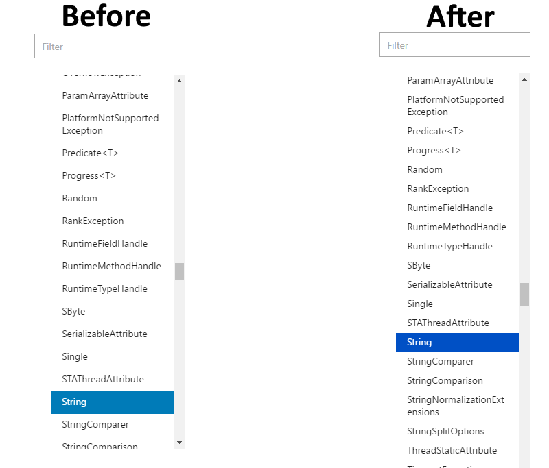

# APEX Sprint S115 Summary Report

Sprint dates:  03/06/2017 - 03/24/2017

Deployment date:  03/27/2017


Welcome to the APEX Sprint Summary Report.  This report is an expansion of a best practice out of Shanghai and represents one of the many ways that we are starting to align the engineering efforts across our broader team.  We have expanded to include visibility to the content releases as well, and will continue to refine and improve the update over time. (We will also target to send this a few days earlier within each sprint.) The lower portions of the report contain more details on the features and can be accessed from the "In This Article" section on the sidebar.

From a business perspective, the features delivered this Sprint supported the major releases for .NET framework and Azure, with a focus on improved reference functionality.

NOTE: By default, the entire APEX org is on the distribution list for this initial report, and you can remove yourself by clicking on the unsubscribe link.  Similarly, you are welcome  to forward this to any internal partners or stakeholders that you think would value the updates, and they can add themselves to the distribution by selecting the subscribe link.


|Click for live URL! | Go live date  |Contacts  |Group  |
|---------|---------|---------|---------|
|[Visual Studio 2017 GA](https://docs.microsoft.com/en-us/visualstudio/)<br>[VS Scripting](https://docs.microsoft.com/en-us/scripting/)|March 7, 2017|Gordon Hogenson<br>Megan Bradley<br>Nobuko Kurashige |Visual Studio |
|[Azure Container Services REST](https://docs.microsoft.com/en-us/rest/api/compute/containerservices)|March 7, 2017|Paulina Cortes <br> Dan Lepow |Azure|
|[Cordova](https://docs.microsoft.com/en-us/visualstudio/cross-platform/tools-for-cordova/index) | March 9, 2017| Jordan Matthiesen<br>Megan Bradley|Visual Studio | 
|[Azure Billing REST](https://docs.microsoft.com/en-us/rest/api/billing/)|March 9, 2017|Paulina Cortes <br> John Lian |Azure|
|[Azure Data Movement .NET](https://docs.microsoft.com/en-us/dotnet/api/microsoft.windowsazure.storage.datamovement)|March 12, 2017|Paulina Cortes <br> Marsh Macy |Azure|
|[Azure Batch .NET](https://docs.microsoft.com/en-us/dotnet/api/microsoft.azure.batch)|March 13, 2017|Paulina Cortes <br> Tamra Myers |Azure|
|[Azure Billing .NET](https://docs.microsoft.com/en-us/dotnet/api/microsoft.azure.management.billing)|March 13, 2017|Paulina Cortes <br> John Lian |Azure|
|[Azure Advisor REST](https://docs.microsoft.com/en-us/rest/api/advisor/)|March 14, 2017|Paulina Cortes <br> Manbeen Kohli |Azure|
|[Azure Resource Manager templates](https://docs.microsoft.com/en-us/azure/templates/) | March 16, 2017| Sanketh Arvapally  <br> Tom FitzMacken  |  Azure      | 


|Click for details! |VSTS  |Owners  |Impact  |
|---------|---------|---------|---------|
| [Generation of PDF files for relative TOCs](#generation-of-pdf-files-for-relative-tocs)| [923146](https://mseng.visualstudio.com/CSI/_workitems?id=923146) |Den Delimarschi (PM)<br>Ken Chen (Dev)<br> Duncan Mackenzie (Dev)  |End users |
| [FY17Q3 Build and Publish Performance Upgrade](#fy17q3-build-and-publish-performance-upgrade) | [798136](https://mseng.visualstudio.com/CSI/_workitems?id=798136) | Xiaokai He (PM)<br>Ken Chen (Dev)    | Writers  | 
| [Repo Management Updates](#repo-management-updates)| [661221](https://mseng.visualstudio.com/CSI/_workitems?id=661221)<br> [655649](https://mseng.visualstudio.com/CSI/_workitems?id=655649) <br>[660475](https://mseng.visualstudio.com/CSI/_workitems?id=660475)|Sandra Aldana Abad (PM)<br>Ken Chen (Dev) |  OPS users |
| [Bilingual publishing](#bilingual-publishing)|  [925968](https://mseng.visualstudio.com/CSI/_workitems?id=925968)<br> [923408](https://mseng.visualstudio.com/CSI/_workitems?id=923408) |Eman Shaheen (PM) <br>Zhiliang Xu (Dev)| IPM  |
| [CAPS Exporter Upgrade](#caps-exporter-upgrade)    | [891351](https://mseng.visualstudio.com/CSI/_workitems?id=891351)        |Alice Wang (Dev)<br>Megan Bradley (PM)       | CAPS to OPS Migration tool users |
| [Offline Book New Tooling](#offline-book-new-tooling) | [785016](https://mseng.visualstudio.com/CSI/_workitems?id=785016)<br> [938097](https://mseng.visualstudio.com/CSI/_workitems?id=785016)| Hui Xie (PM)<br>Zhiliang Xu (Dev)  | Offline book users   |
| [Markdown Syntax Update](#markdown-syntax-update) |  [866833](https://mseng.visualstudio.com/CSI/_workitems?id=866833)<br> [955072](https://mseng.visualstudio.com/CSI/_workitems?id=955072) |  Ken Chen (Dev)| Writers |
| [Gauntlet Dogfood Release](#gauntlet-dogfood-release)|[Gauntlet 1.5.5](https://mseng.visualstudio.com/DefaultCollection/CSI/_workitems?id=710560a4-ad37-4631-80c8-f0e167ba0501&_a=query-edit)|Megan Bradley (PM)<br>Martin O'Flaherty (PM) <br>Jamar Warren (Dev)|Writers, PMs (UAT group)|
| [PR Comment Improvement](#pr-comment-improvement)|[944217](https://mseng.visualstudio.com/VSChina/_workitems?id=944217)|Xiaokai He (PM)<br>Ken Chen (Dev)|Writers|


|Release |Target Date  |Contacts  |Group  |
|---------|---------|---------|---------|
|.NET Framework 4.7 |April 5, 2017|Maira Wenzel<br>Megan Bradley<br>Nobuko Kurashige |.NET |
| VS2017 Offline book| March 31, 2017| Warren Nolder <br> Gordon Hogenson <br> Hui Xie | Visual Studio | 
| SharePoint| (//BUILD) May 10, 2017| Sandra Aldana <br> David Chesnut <br> Laura Graham | Office | 
| Microsoft Graph | (//BUILD) May 10, 2017| Sandra Aldana <br> Keyur Patel <br> David Chesnut <br> Laura Graham | Office | 
| VBA | (//BUILD) May 10, 2017| Sandra Aldana <br> David Chesnut <br> Laura Graham | Office | 
| Health Vault | (//BUILD) May 10, 2017| Sandra Aldana <br> Justin Hutchings | Cross product | 
| Cognitive Toolkit | (//BUILD) May 10, 2017| Sanketh Arvapally | Independant 


|Click for details! |VSTS  |Owners  |Impact  |
|---------|---------|---------|---------|
| [A/B and Before/After Experimentation for writers] | [937505](https://mseng.visualstudio.com/CSI/_workitems?id=937505) [937506](https://mseng.visualstudio.com/CSI/_workitems?id=937506) [937504](https://mseng.visualstudio.com/CSI/_workitems?id=937504) | Saurabh Choudhury (PM) <br> Ricky Kurniawan (Dev) Sarah Baranowski (Researcher) | Writers|
| [Xamarin for April 5 release](#xamarin-for-april-5-release)    | [786738](https://mseng.visualstudio.com/CSI/_workitems?id=786738) | Yun Lu (PM)<br>Alice Wang (Dev)  | .NET users|
| [API Browser](#api-browser)    |  [924060](https://mseng.visualstudio.com/CSI/_workitems?id=924060) | Den Delimarschi (PM) <br> Duncan Mackenzie (Dev)|  End users       | 
| [PowerShell for March 31 release](#powershell-for-march-31-release)   |  [924038](https://mseng.visualstudio.com/CSI/_workitems?id=924038)       |Yun Lu (PM)<br> Ken Chen (Dev)<br> Duncan Mackenzie (Dev) |  PowerShell users       |
|[PRMerger Gauntlet integration](#prmerger-gauntlet-integration) |[796423](https://mseng.visualstudio.com/CSI/_workitems?id=796423&_a=edit&triage=true)|Eman Shaheen (PM)<br>Davanand Bahall (Dev)|Writers, other contributors |
|[Gauntlet Metadata Validation](#gauntlet-metadata-validation) |[658002](https://mseng.visualstudio.com/DefaultCollection/CSI/_workitems?id=658002&_a=edit&triage=true)|Sudeep Kumar (PM)<br>Peter Ibekwe (Dev)<br>Petr Abraham (Dev)  |Writers, BI team  |         
|[Interactive Tutorials](#interactive-tutorials) | [656324](https://mseng.visualstudio.com/DefaultCollection/CSI/_workitems?id=656324) | Rob Eisenberg (PM) <br> Ken Chen (Dev) <br> Zhiliang Xu (Dev) <br> Duncan Mackenzie (Dev) | End Users | 
|[Try It](#try-it) | [953670](https://mseng.visualstudio.com/CSI/_workitems?id=953670) | Rob Eisenberg (PM) <br> Ken Chen (Dev) <br> Zhiliang Xu (Dev) <br> Duncan Mackenzie (Dev) | End Users | 
| OL/iCMS phase2 and CEO perfomrance | [866408](https://mseng.visualstudio.com/DefaultCollection/CSI/_workitems?id=866408) [799284](https://mseng.visualstudio.com/DefaultCollection/CSI/_workitems?id=799284) [866405](https://mseng.visualstudio.com/DefaultCollection/CSI/_workitems?id=866405)| Sonja Saltzman (PM) <br> Zhiliang Xu (Dev)| IPM | 
| Azure .NET: Support Fluent API Document and mapped TOC | [956925](https://mseng.visualstudio.com/DefaultCollection/CSI/_workitems?id=956925) [953840](https://mseng.visualstudio.com/DefaultCollection/CSI/_workitems?id=953840)| Brady Gaster (PM) <br> Alice Wang (Dev) | Azure .NET Users|
| Azure Java: Support Fluent API Document and mapped TOC | [956927](https://mseng.visualstudio.com/DefaultCollection/CSI/_workitems?id=956927) [953842](https://mseng.visualstudio.com/DefaultCollection/CSI/_workitems?id=953842) | Yun Lu (PM) <br> Ken Chen (Dev) | Azure Java Users|
| REST: Support Swagger schema definitions from external files| [928906](https://mseng.visualstudio.com/DefaultCollection/CSI/_workitems?id=928906) | Brady Gaster (PM) <br> Ken Chen (Dev) | REST Users| 
|[Restyled TOC](#restyled-toc) |[936367](https://mseng.visualstudio.com/VSChina/Docs%20Site%20and%20Services/_workitems?id=936367&fullScreen=true&_a=edit) |Duncan Mackenzie (Dev)|End users|
| [AFD Integration and Audience Segmentation] | [945741](https://mseng.visualstudio.com/CSI/_workitems?id=945741)| Saurabh Choudhury (PM) <br> Ricky Kurniawan (Dev) Simon Wu (Dev) Sarah Baranowski (Researcher) | Writers|


- [OPS Yammer Group](https://www.yammer.com/microsoft.com/#/threads/inGroup?type=in_group&feedId=7133984)
- [OPS docs](https://opsdocs.azurewebsites.net/en-us/opsdocs/index?branch=master)
- [DRAFT Onboarding guides](https://review.docs.microsoft.com/en-us/help/contribute/)
- DL: Join [this group](http://idwebelements/GroupManagement.aspx?Group=ceapexsprint&Operation=join) to subscribe to this sprint summary!
 

## Experimentation MVP for writers
We are building the MVP version of experimentation portal for writers.
- Experiment Flow Spec [https://review.docs.microsoft.com/en-us/new-hope/specs/experimentation/experiment%20status]
- Experiment Metrics [https://review.docs.microsoft.com/en-us/new-hope/specs/experimentation/metrics%20for%20single%20page%20ab%20testing]

## Xamarin for April 5 release

We are making a new .NET documentation experience which will be shipped by April 5.

- Build a unified binary-based experience for all .NET documentation(including Azure .NET SDK, .NET standard, .NET Framework, .NET Core and Xamarin) with integrated versioning support.
- Migrate all CAPS .NET samples and reference content into .NET Documentation.
- Support Markdown embeds in ECMAXML.
- Ensure support for versioning within the same type reference doc.

**More info**<br>
[Spec](https://microsoft.sharepoint.com/teams/CE_CSI/_layouts/15/WopiFrame.aspx?sourcedoc=%7BA1CB7372-7821-4B15-85AD-1ECBA57BA753%7D&file=XamarinRef.docx&action=default)<br>

***

## API Browser

API Browser is a new way to find and view .NET reference topics on docs.microsoft.com. It will go live for the .NET Framework release on April 5.

**More info**<br>
[Spec (design not up to date)](https://microsoft.sharepoint.com/teams/CE_CSI/_layouts/15/WopiFrame.aspx?sourcedoc=%7B09CF1FF2-EDD4-47B8-96B6-A254168717A5%7D&file=version-selector.docx&action=default )<br>
[Test page - try it!](https://review.docs.microsoft.com/en-us/DevSandbox/apibrowser/ )

***

## PowerShell for March 31 release


We are making a new PowerShell experience with the aim of making the PowerShell cmdlets for Azure easier to find by supporting versioning and presenting them in the TOC in a service-first style. It will be shipped by March 31.

**More info**<br>
[Spec](https://review.docs.microsoft.com/en-us/new-hope/specs/reference/azure-powershell-2017-03-31)<br>
[Staging](https://review.docs.microsoft.com/en-us/powershell-new/azure/overview?view=azurermps-3.7.0)<br>


***

## Restyled TOC

Across docs.microsoft.com TOCs have been restyled to reduce vertical space, increase horizantal space, and have a new highlight color.



## Generation of PDF files for relative TOCs

Previously one topic can only belong to one PDF file (which corresponds to one TOC). That means if one topic belongs to multiple TOC files, you can only download its PDF when you view this topic from one "master" TOC.

In this sprint, we have improved PDF download scenario that you can download different PDF files when you view a topic from different TOCs.

Here is an [example](https://docs.microsoft.com/en-us/azure/virtual-machines/virtual-machines-windows-extensions-features?toc=%2fazure%2fvirtual-machines%2fwindows%2ftoc.json
) of the PDF download link under contextual TOC scenario.

***

## FY17Q3 Build and Publish Performance Upgrade

A couple of performance improved is done in last sprint:

1. Change some post build/publish steps to offline jobs to improve E2E publish time.
2. Change email notification to async step.

The publish and PR time on azure-docs-pr after S114 deployment is about **6** minutes (was 8 minutes last sprint).

**More info**<br>
[Spec](https://microsoft.sharepoint.com/teams/Visual_Studio_China/_layouts/15/WopiFrame.aspx?sourcedoc=%7BC93A3049-94DF-49BB-97CD-77A21A2490CF%7D&file=Incremental%20Build%20Spec.docx&action=default)<br>

***

## Repo Management Updates

### Feature Summary 
1. Enable migration of repos from Microsoft Org to MicrosoftDocs Org 
2. Enhancements in OPS build portal based on user feedback
3. Use service accounts to provision repos and write status messages on a PR thread.

When you de-provision a repo, 
 - repo does not show up in the portal
 - all OPS related config files are removed from the repo.
 - If English repo is de-provisioned, all localized repos are deprovisioned as well.
 - all published content is deleted
 - users do not get any build notification
 
When you submit a PR,
- OPS notifications and comments come from a service account.

 
**More info**<br>
[Spec](https://opsdocs.azurewebsites.net/en-us/opsdocs/specdocs/provisioning?branch=master)<br>

[Demo](https://ops.microsoft.com/#/)<br>

***

## Bilingual publishing

### Feature Summary

Enable all segments to have side by side bilingual display through the use of bilingual markdown file.

### Problem Statement

The existing bilingual service cannot translate all segments of a localized page in *docs.microsoft.com*. The estimated translation rate is only around 60%, which is not high enough for both mouse hover and side by side display.

This proposal embeds per sentence translation information into the source markdown file to ensure every sentence has a translation.

**More info**<br>
[Spec](https://mseng.visualstudio.com/VSChina/_git/OpenLocalization.MDTransformer?path=%2Fspecs%2Fbilingual-markdown.md&_a=preview)<br>
[User doc](https://opsdocs.azurewebsites.net/en-us/opsdocs/partnerdocs/localization/loc_bilingual_feature?branch=master)<br>
[Sample Page](https://ppe.docs.microsoft.com/de-de/files/list?branch=master-sxs)<br>

***

## CAPS Exporter Upgrade

### Feature Summary

CAPS exporter tool need to support to ignore TOC.md generation for different team requirements. 

### Configuration detail
If user need to ignore TOC.md generation, please add below configuration in caps exporter configuration file. 
"IgnoreTOC": true

This key has default value to false. Export tool will choose to generate TOC.md file if this configuration key is not added or set as false.

**More info**<br>
[Spec](https://mseng.visualstudio.com/VSChina/_workitems?id=891351&triage=false&_a=edit)<br>
[User doc](https://opsdocs.azurewebsites.net/en-us/opsdocs/partnerdocs/capsmigration?branch=master)<br>

***

## Offline Book New Tooling

Offline book new tooling is supported since S115 and verified with VS2017 offline book release (coming soon).

The main changes introduced by this offline book new tooling are:
- Support content source from OPS in addition to MTPS
- Host offline book ServiceAPI in Azure instead of on-prem server
- De-couple book generation from content publishing status so as to simplify the E2E workflow
- De-couple book generation from Eng dev cycle so as to decrease the turnaround of book requests

**More info**<br>
[User doc](../partnerdocs/offlinebook.md)<br>
[Dev Design Spec](https://microsoft.sharepoint.com/teams/Visual_Studio_China/ALPS/_layouts/15/WopiFrame.aspx?sourcedoc=%7BE2B6B7BA-1B46-45F1-8B1F-5EE187A3953E%7D&file=Offline%20Book%20Design%20Spec.docx&action=default&IsList=1&ListId=%7BA37077A4-59A8-4A3A-BF1F-B4A68B79FA71%7D&ListItemId=998)<br>
[Demo](https://microsoft.sharepoint.com/teams/Visual_Studio_China/_layouts/15/guestaccess.aspx?guestaccesstoken=LS5etk09GC5JWQxwc0B8oXKJZD3H7FsiMS%2booTgbDc0%3d&docid=2_092fc74326d3b40a3962c7125baa1095b&rev=1)<br>

***

## Markdown Syntax Update

Previously '~' (which means the root folder of a docset) can only be used in markdown links and images but not when including a token file. In this sprint we also enabled this syntax on include file so you don't need to calculate relative path when including a token file, like this:

```markdown
[!include[token](~/includes/token.md)]
```

Github has recently switched to a [new Markdown engine](https://githubengineering.com/a-formal-spec-for-github-markdown/), which introduced a lot of behavior changes in Markdown syntax. Since we follow GFM as a standard, we also follow these changes so user will notice OP now behave differently when rendering some Markdown syntax, here are a list of them:

1. Headings

   Now it's **REQUIRED** to have a whitespace between # and heading title:

   ```markdown
   # Heading1
   ```

   This syntax will no longer render:
   ```
   #Heading1
   ```

2. Lists

   Now text in list items needs to be strictly aligned otherwise they will be outside and stop the list. For example, previously this is valid list:

   ```markdown
   1. Item1

    Some text

   2. Item2
   ```

   Now "Some text" will be outside the list and "Item2" will be a new list. Instead you need to indent "Some text" to make it align with other list items, like this:

   ```markdown
   1. Item1

      Some text

   2. Item2
   ```

   Also previously a list is only stopped by a blank line followed by a line of text without **any** indent. Now without proper indent, a list will be stopped in the following cases:

   - A blank line followed by a line of text
   - Any block element, like heading, code block

   Another change in list is previously an ordered list always starts from 1, no matter which number you write in Markdown source, for example, below will render to a list starting from 1:

   ```markdown
   0. Item1
   1. Item2
   ```

   Now the list will start from the index number of the first item. For example, the list above will start from 0.

3. Blockquotes

   Previously a blockquote is only stopped by a blank line, now it will also stopped when by any block elements, for example, this used to be one blockquote:

   ```markdown
   > Some text
   - Item1
   - Item2
   ```

   Now the list will be outside the block, you need to also add ">" before list items to make them inside the blockquote, like this:

   ```markdown
   > Some text
   > - Item1
   > - Item2

4. Definitions

   Now you can write definitions inside block elements like lists, which is not allowed before, for example:

   ```markdown
   1. [name]: url
   ```

   This one used to render as a plain text. Now it will be recognized as a definition so will render to an empty list item.

***

## Gauntlet Dogfood Release

The second release of the Gauntlet VS Code extension and template sevice includes various bug fixes and feature updates, including the ability to insert alerts (notes, warnings, tips, importamt); filtering by file type to make inserting links and includes easier; fixes to lists; removing the requirement to manually update settings on installation; and providing a toolbar button for submitting feedback.

Gauntlet is currently only available to a limited Dogfood group of writers and PMs. If you would like to participate, contact gauntletsupport@microsoft.com.

The first production release of Gauntlet, including the toolbar and template service, is scheduled for April 17.

**More info**<br>
User doc: [http://aka.ms/GauntletDocs](http://aka.ms/GauntletDocs)

***

## PR Comment Improvement

In this sprint, we have improved PR comment to also include files that are not directly changed in the PR but got impact by other files. For example, if a file is renamed, PR comment will now show files which contains links to this file (they now become broken links).

Here are some sample pull requests for this improvement:

1. If link becomes invalid, show impacted documents and their warnings: https://github.com/MicrosoftDocs/openpublishing-docs/pull/205
2. If link becomes invalid, show impacted TOCs and their warnings: https://github.com/MicrosoftDocs/openpublishing-docs/pull/208

***

## PRMerger Gauntlet Integration

The current PRMerger tool, which provides automated pull request review and merging if certain criteria are met, was refactored into C# in sprint 115 as the first step in integrating it into Gauntlet. Once integrated, PR Merger (which is currently only available for Azure) will be made available to other content sets, starting with a designated pilot.

V1 integration is scheduled to be completed in sprint 117.

**More info:**<br>
[See spec](https://microsoft.sharepoint.com/teams/CE_CSI/Shared%20Documents/Forms/AllItems.aspx?FolderCTID=0x01200069E461F37D24AD49B04A7C2B9F4D0BB3&View=%7b7E31666A-8D21-43CF-8574-931DB14C10DB%7d&id=/teams/CE_CSI/Shared%20Documents/CSI%20Spec%20Library/PRMERGER2/PRMerger2_Requirements.docx&sortField=Editor&isAscending=true&parent=/teams/CE_CSI/Shared%20Documents/CSI%20Spec%20Library/PRMERGER2)

***

## Gauntlet Metadata Validation

The first Gauntlet validation feature will be metadata validation, including BI metadata and SEO metadata. The feature is code complete as of sprint 115 and is now entering testing. When released, content team admins will be able to configure validation rules in the Gauntlet web UI, and writers and contrinutors will be able to validate their files via the Gauntlet VS Code extension.

Other validations, such as Markdown/HTML content validation and link checking, are planned for Gauntlet but not yet scheduled for a sprint.

**More info:**<br>
[See spec](https://microsoft.sharepoint.com/teams/CE_CSI/_layouts/15/WopiFrame.aspx?sourcedoc=%7B11C4D8DA-4D1E-4E70-96AC-3F6A46006DBA%7D&file=Meta%20Data%20Validation%20Functional%20Spec.docx&action=default)

***

## Interactive Tutorials

Interactive Tutorials are a new form of conceptual content that builds on our existing foundation. A Tutorial takes a customer through an interactive, step-by-step experience. It features a custom landing page, rich with contextual information related to the Tutorial, an in-page step-by-step process, persistent progress tracking, interactive code editors, CLIs and more.

This feature is currently in the final design stage, in preparation for an MVP release at //build.

**More info**<br>
[See spec](https://review.docs.microsoft.com/en-us/new-hope/specs/conceptual/interactive-guides?branch=master)<br>
[See prototype](https://review.docs.microsoft.com/en-us/new-hope/prototypes/interactive-guides/index.html)<br>

***

## Try It

"Try It" is an enhancement to code samples on docs.microsoft.com. This feature will add a new button labeled "Try It" or "Run" to certain code samples. Clicking the button will allow our customers to run the code sample directly in the browser. Initial support will include the Azure CLI and .NET REPL experiences, with more to follow.

This feature is currently undergoing a re-design and re-scoping to enable an MVP for //build.

***

## LEAVE (Un-subscribe)
http://idwebelements/GroupManagement.aspx?Group=ceapexsprint&Operation=leave 

## JOIN (Subscribe)
http://idwebelements/GroupManagement.aspx?Group=ceapexsprint&Operation=join 
