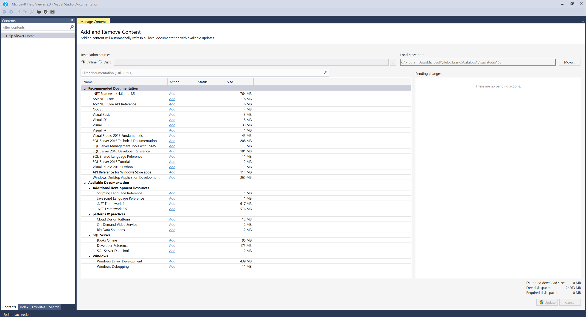

# APEX Sprint 116 Summary Report

Sprint dates:  03/27/2017 - 04/14/2017

Deployment date:  04/17/2017

Welcome to the APEX Sprint Summary Report for Sprint 116. We received a lot of positive feedback from our initial update, and we are excited to continue to evolve and improve this as one of the key communication channels related to our online docs efforts.  While you most likely received this in your Inbox, we encourage you to read the [online version](https://opsdocs.azurewebsites.net/en-us/OPSDocs/release-notes/sprint116?branch=master) which will always be the most up-to-date .

We had three significant updates released to customers on docs.microsoft.com during S116. The customer feedback has been very strong and positive.  ***Congratulations to all involved!***
- Launched a new Get Started page for our Azure docs with dramatically simplfied content, and an easy-to-remember URL to find it: [http://aka.ms/AZeasy](http://aka.ms/AZeasy).  
- Organized our .NET reference documentation [in one place](https://docs.microsoft.com/en-us/dotnet/api/) that is searchable, responsive, and with versioning.  
- Released [major updates to Azure PowerShell](https://docs.microsoft.com/en-us/powershell/azure/overview?view=azurermps-3.7.0) with versioning, colorization, and customer contributions.  

We also made two key improvements internally to help those working with docs:
- Our content onboarding plans have now transitioned to VSTS.  You can see the [complete backlog here](https://mseng.visualstudio.com/csi/_workitems?id=3c45d380-9fe3-4fd3-90e9-6a994e1b703a&_a=query), and we are working to ensure that all engineering dependencies are captured within the records, as well as any related discussions
- We are introducing *SiteHelp* [(http://aka.ms/sitehelp)](http://aka.ms/sitehelp), a replacement for MSDNHelp.  The RC version is now available and you can start using it to log issues related to docs.microsoft.com, review.docs.microsoft.com, developer.microsoft.com, MSDN, Technet or VSCom.  You can also log any issue encountered when authoring or publishing content to any of these sites, or using internal tools, or even to make a feature requests! *SiteHelp* includes a Search feature so you can also easily find previously-reported items. Please send your [feedback](mailto:guangw@microsoft.com;saldana@microsoft.com?subject=[SiteHelp%20Portal%20Feedback]) and we will keep refining and expanding based on your comments and usage patterns. For more information, visit the [support page](../support.md). 
- Launched a new simplified intuitive [Experimentation platform](http://aka.ms/skyeyeexp). The platform will currently enable writers to conduct single page A/B Testing and Before After testing. More type of experimentation are under active development. The team will send out a training announcement soon. For any questions or interests, please feel free to reach out to saurabhc@ or sarbar@.

Finally, as we look forward to S117, we are focusing our efforts to get ready for **//Build** which is May 10-12.  Some of the features delivered in S116 lay the groundwork for additional content sets as well as site functionality, with additional features being added in S117 as needed.  Read on to learn more about both.

> [!NOTE]
> You are welcome to forward this to any internal partners or stakeholders that you think would value the updates, and they can add themselves to the distribution by selecting the [subscribe link](http://idwebelements/GroupManagement.aspx?Group=ceapexsprint&Operation=join).  Similarly, if you are no longer interested in receiving, you can remove yourself from the distribution list by clicking on the [unsubscribe link](http://idwebelements/GroupManagement.aspx?Group=ceapexsprint&Operation=leave). 

  

|Click for live URL!  |Go live date  |Contacts  |Group  |
|---------|---------|---------|---------|
|[.NET Framework 4.7](https://docs.microsoft.com/en-us/dotnet/)| April 5, 2017 | Maira Wenzel   Den Delimarschi   Yun Lu   Megan Bradley   Nobuko Kurashige | .NET |
|[UWP Schemas and Extension SDK](https://docs.microsoft.com/en-us/uwp/)| April 5, 2017 |Mark LeBlanc   Paulina Cortes |Windows|
|[VS2017 Offline book (Wave1)](#vs2017-offline-book-wave1)| April 7, 2017| Gordon Hogenson   Warren Nolder   Hui Xie | Visual Studio | 
|[Cognitive Services](https://docs.microsoft.com/en-us/azure/cognitive-services/)|April 11, 2017| Tyson Nevil   Sanketh Arvapally|Azure|
|[AzureStack Powershell](https://docs.microsoft.com/en-us/powershell/azure/overview?view=azurestackps-1.2.9)| April 12, 2017| Sneha Guda   Sanketh Arvapally| Azure |
|[Azure Automation Service REST API](https://docs.microsoft.com/en-us/rest/api/automation/)| April 12, 2017| Matt Goedtel   Sanketh Arvapally| Azure|

|Click for details!  |VSTS  |Owners  |Impact  |
|---------|---------|---------|---------|
|[Xamarin for April 5 release](#xamarin-for-april-5-release)|[786738](https://mseng.visualstudio.com/CSI/_workitems?id=786738) | Den Delimarschi (PM) Yun Lu (PM) Alice Wang (Dev)  | .NET users|
|[API Browser for .NET](#api-browser-for-net)    |  [924060](https://mseng.visualstudio.com/CSI/_workitems?id=924060) | Den Delimarschi (PM)   Duncan Mackenzie (Dev)|.NET users| 
|[PowerShell for April 5 release](#powershell-for-april-5-release)   |  [924038](https://mseng.visualstudio.com/CSI/_workitems?id=924038)|Sanketh Arvapally/Brady Gaster/Yun Lu (PM)  Ken Chen (Dev)  Duncan Mackenzie (Dev) |PowerShell users|
|[REST: Support Swagger schema definitions from external files](#rest-support-swagger-schema-definitions-from-external-files) |[928906](https://mseng.visualstudio.com/CSI/_workitems?id=928906)|Brady Gaster (PM)  Ken Chen (Dev)|Networking REST API users|
|[New Markdown Processor](#new-markdown-processor) |[866833](https://mseng.visualstudio.com/CSI/_workitems?id=866833)  [955072](https://mseng.visualstudio.com/CSI/_workitems?id=955072) | Zhenghui Yan (Dev)| Writers |
|[OL/iCMS phase2 and CEO perfomrance](#olicms-phase2-and-ceo-perfomrance) | [866408](https://mseng.visualstudio.com/DefaultCollection/CSI/_workitems?id=866408) [799284](https://mseng.visualstudio.com/DefaultCollection/CSI/_workitems?id=799284) [866405](https://mseng.visualstudio.com/DefaultCollection/CSI/_workitems?id=866405)| Sonja Saltzman (PM)   Zhiliang Xu (Dev)| IPM | 
| [A/B and Before/After Experimentation for writers](http://aka.ms/skyeyeexp) | [937505](https://mseng.visualstudio.com/CSI/_workitems?id=937505) [937506](https://mseng.visualstudio.com/CSI/_workitems?id=937506) [937504](https://mseng.visualstudio.com/CSI/_workitems?id=937504) | Saurabh Choudhury (PM)   Ricky Kurniawan (Dev) Sarah Baranowski (Researcher) | Writers| 

|Release |Target date  |Contacts  |Group  |
|---------|---------|---------|---------|
|Bot Framework - ENU| April 25, 2017 |  Robert Standefer   Sudeep Kumar |   Cross Product      | 
|IT Pro     |  April, 28 2017       |Dina Bennet   Paulina Cortes  | Windows        |
|System Center 2017 | April 28, 2017 |  Charles Freeman   Sudeep Kumar |   C+E     | 
| SharePoint - ENU| (//Build) May 10, 2017| David Chesnut Laura Graham Sandra Aldana  | Office | 
| VBA - ENU | May 15, 2017| John Austin   Laura Graham Sandra Aldana | Office | 
| HealthVault - ENU| (//Build) May 10, 2017| Justin Hutchings Sandra Aldana | Cross-product | 
|Cognitive Toolkit| (//Build) May 10, 2017| Dave Ahler   Sanketh Arvapally| Cross-product |
|Springfield| (//Build) May 10, 2017 | Ram Nagaraja   Sanketh Arvapally | Cross-product|
|Mooncake |June 19, 2017|Fangfang Wu  Hui Xie|  Azure  |

[View query](https://mseng.visualstudio.com/CSI/_queries?_a=query&id=3c45d380-9fe3-4fd3-90e9-6a994e1b703a)

|Click for details!  |VSTS  |Owners  |Impact  |
|---------|---------|---------|---------|
|[Fusion TOC for Azure .NET](#fusion-toc-for-azure-net) |[953840](https://mseng.visualstudio.com/DefaultCollection/CSI/_workitems?id=953840)| Brady Gaster (PM)   Alice Wang (Dev) | Azure .NET Users|
|[Fusion TOC for Azure Java](#fusion-toc-for-azure-java)|[953842](https://mseng.visualstudio.com/DefaultCollection/CSI/_workitems?id=953842) | Yun Lu (PM)   Ken Chen (Dev) | Azure Java Users|
|[Interactive Tutorials](#interactive-tutorials) | [656324](https://mseng.visualstudio.com/DefaultCollection/CSI/_workitems?id=656324)  [795312](https://mseng.visualstudio.com/DefaultCollection/CSI/_workitems?id=795312)| Rob Eisenberg (PM)   Ken Chen (Dev)   Zhiliang Xu (Dev)   Duncan Mackenzie (Dev) | End Users | 
|[Enhanced Code Samples](#enhanced-code-samples) | [953670](https://mseng.visualstudio.com/CSI/_workitems?id=953670) | Rob Eisenberg (PM)   Ken Chen (Dev)   Zhiliang Xu (Dev)   Duncan Mackenzie (Dev) | End Users | 
|[REST: Emulate MVC TOC structure for partners](#rest-emulate-mvc-toc-structure-for-partners) | [965415](https://mseng.visualstudio.com/CSI/_workitems?id=965415) | Brady Gaster (PM)   Ken Chen (Dev) |   REST users      |
|[Constructors](#constructors) |[796304](https://mseng.visualstudio.com/CSI/_workitems?id=796304) | Den Delimarschi (PM)   Zhiliang Xu (Dev) |  End Users       |
|[OL-iCMS Phase2](#ol-icms-phase2)| [769889](https://mseng.visualstudio.com/CSI/_workitems?id=769889)  [950836](https://mseng.visualstudio.com/CSI/_workitems?id=950836)  [799275](https://mseng.visualstudio.com/CSI/_workitems?id=799275) |  Sonja Saltzman (PM)   Zhiliang Xu (Dev) | IPM |
|Build and Publish Performance Upgrade for .NET |[957146](https://mseng.visualstudio.com/CSI/_workitems?id=957146) |  Ken Chen (Dev) |  .NET Writers  |
|[Content Switcher for Conceptual](#content-switcher-for-conceptual) |[710460](https://mseng.visualstudio.com/CSI/_workitems?id=710460) |  Rob Eisenberg (PM)   Ken Chen (Dev) |  Writers  |
|[Gauntlet Production Release 1](#gauntlet-production-release)|  |Megan Bradley (PM) Martin O'Flaherty (PM) Jonathan Duncan (Dev lead)|docs writers and contributors|
|[PRMerger Gauntlet integration (dogfood)](#prmerger-gauntlet-integration) |[796423](https://mseng.visualstudio.com/CSI/_workitems?id=796423&_a=edit&triage=true)|Eman Shaheen (PM) Martin O'Flaherty (PM) Davanand Bahall (Dev)|Writers, other contributors |
|[Gauntlet Metadata Validation (dogfood)](#gauntlet-metadata-validation) |[658002](https://mseng.visualstudio.com/DefaultCollection/CSI/_workitems?id=658002&_a=edit&triage=true)|Sudeep Kumar (PM) Megan Bradley (PM) Peter Ibekwe (Dev) Petr Abraham (Dev)  |Writers, BI team  |
| [AFD Integration and Audience Segmentation](https://review.docs.microsoft.com/en-us/new-hope/specs/experimentation/audience%20segmentation) | [945741](https://mseng.visualstudio.com/CSI/_workitems?id=945741)| Saurabh Choudhury (PM)   Ricky Kurniawan (Dev) Simon Wu (Dev) Sarah Baranowski (Researcher) | Writers| 

- [OPS Yammer Group](https://www.yammer.com/microsoft.com/#/threads/inGroup?type=in_group&feedId=7133984)
- [OPS docs](https://opsdocs.azurewebsites.net/en-us/opsdocs/index?branch=master)
- [DRAFT Onboarding guides](https://review.docs.microsoft.com/en-us/help/contribute/)
- DL: Join [this group](http://idwebelements/GroupManagement.aspx?Group=ceapexsprint&Operation=join) to subscribe to this sprint summary!
      

## Xamarin for April 5 release

We have switched the entire managed reference workflow to rely on `mdoc`-generated ECMAXML. `mdoc` is a [tool written by our partners in Xamarin](https://github.com/mono/api-doc-tools) that reflects ECMA335 assemblies and generates documentation XML files. `mdoc` is also capable of integrating existing Roslyn-generated XML docs into the new format. Throughout the last sprint, Joel Martinez, the primary developer behind `mdoc`, has integrated a significant number of changes into the tooling that allows our systems to work as designed, such as: 
* Enabling `mdoc` to generate documentation for multiple frameworks ([GitHub Issue](https://github.com/mono/api-doc-tools/issues/13)) 
* Generate DocIDs for all types/members that are placed in XML files ([GitHub Issue](https://github.com/mono/api-doc-tools/issues/31)) 
* Add support for .NET Core ([GitHub Issue](https://github.com/mono/api-doc-tools/issues/5)) 
 
Joel also has fixed more than 25 significant issues that would have prevented content integration, in a very short timespan. 

We have intergrated mdoc into OPS pipeline, including:
* Build a unified binary-based experience for all .NET documentation(including Azure .NET SDK, .NET standard, .NET Framework, .NET Core and Xamarin) with integrated versioning support.
* If there is an update on mdoc-generated ECMAXML files, OPS can auto generate DocFX readable YML files based on mdoc-generated ECMAXML files and then build and publish reference documentation to docs.microsoft.com.
* Migrate all CAPS .NET samples and reference content into .NET Documentation.
* Support Markdown embeds in ECMAXML.
* Ensure support for versioning within the same type reference doc.

**More info** 
* [MDOC Repo](https://github.com/mono/api-doc-tools) 
* [MDOC Pending/Completed Work](https://github.com/mono/api-doc-tools/issues) 
* [DDUEML TO XAMARIN CONVERSION AND MIGRATION SPEC](https://microsoft.sharepoint.com/teams/CE_CSI/_layouts/15/WopiFrame2.aspx?sourcedoc=%7B4dcca772-e801-42e3-ad88-931ada813a12%7D&action=view&wdAccPdf=0&wdparaid=5031C978&wdcomments=1)
***

## API Browser for .NET

After connecting with a number of our customers, our team has determined that the current reference experience is not optimal for search and discoverability across our managed stack. To solve the problem, we have designed and developer the API Browser - an all-in-one experience, that allows API search directly on the site, within seconds, and across a wide variety of frameworks and NuGet packages. 

A significant change in infrastructure for this experience to work was switching to `mdoc`-generated ECMAXML files as the source of published reference content. This means that all managed reference published on docs.microsoft.com is, moving forward, entirely reliant on APIs documented from binaries. You can learn more about the process on the [OPS Managed Reference guide page](https://opsdocs.azurewebsites.net/en-us/opsdocs/reference/managed-reference?branch=master).  

For the API Browser, we also have built an entirely new search service that can understand managed API flows and how they relate, across versions and packages. 

 

At launch (_4/5_) we have scoped the API Browser experience to .NET content only, spanning: 

* .NET Framework (4.5 and up) 
* .NET Core 
* .NET Standard 
* Xamarin.iOS 
* Xamarin.Android 
* Xamarin.Mac 
* Azure NuGet Packages (Management Plane) 

We plan on expanding this experience to other managed SDKs, such as SQL, UWP and HealthVault in the near future. 
 
**More Info** 
* [Blog Post (Announcement)](https://docs.microsoft.com/en-us/teamblog/announcing-unified-dotnet-experience-on-docs) 
* [.NET API Browser](https://docs.microsoft.com/en-us/dotnet/api/) 
* [Spec](https://microsoft.sharepoint.com/teams/CE_CSI/Shared%20Documents/CSI%20Spec%20Library/Docs/api-browser.docx?web=1) 

***

## PowerShell for April 5 release

This is a v2 version for Powershell on Docs. This released enabled a more structured layout for powershell with a combination of Conceptual ref content and cmdlet ref. Also, introduced the flexibility to group the cmdlets by a specific user friendly category name for cmdlets so as to provide easy and contextual navigation in TOC under reference node.      Launched: 
Azure Powershell, Azure Active Directory Powershell, Azure service fabric powershell, Azure Elastic DB pwoershell and Azure Information protection powershell.     Additionally, we launched a brand new hub page for /powershell. 

[Spec](https://review.docs.microsoft.com/en-us/new-hope/specs/reference/azure-powershell-2017-03-31)  
[Powershell on Docs](https://docs.microsoft.com/en-us/powershell/)  
[Azure powershell on Docs](https://docs.microsoft.com/en-us/powershell/azure/overview)  

***

## REST: Support Swagger schema definitions from external files

The Open API Specification (OAI) (formerly known as Swagger) provides support for enabling API description across multiple files. Our REST API documentation generation process needed to be augmented to support Swagger description scenarios in which partner teams have decided to spread their model and/or operation schema across multiple files.

Some teams who have complex Swagger specifications have decided to take advantage of the Swagger specification's support for multiple-file descriptions. The Azure networking and SQL teams, as an example, had distributed their model schema across multiple files as demonstrated in the networking Swagger file in the Azure REST API specs repository.

As time went on, more partners began to emerge that were using the composite-Swagger document approach. As it became evident more partners would be using this approach we decided to support multiple-file documents. The result was that we enabled at least 4 Azure partners like Networking and SQL, and later in the same week API Management and potentially others. 

[Feature Spec](https://review.docs.microsoft.com/en-us/new-hope/specs/reference/swagger-external-references)

***

## OL/iCMS phase2 and CEO perfomrance

When files in the en-US repo are moved or deleted, OpenLoc will push this information into iCMS, so the iCMS information is always up-to-date.
Additionally, when localized files are published by OPS, OpenLoc will update the information in iCMS.  Following info is provided via iCMS UI:
- Publish status (success/failed)
- Publish date/time
- Publish error message (if any)

***

## VS2017 Offline book (Wave1)

Nine (9) Tier1 books are shipped by VS2017 offline book release at April 7, 2017.

Five (5) books replace the corresponding VS2015 version:
- Visual Basic 
- Visual C#
- Visual C++ 
- Visual F# 
- Visual Studio 2017 Fundamentals

Four (4) are new books for VS2017:
- ASP .NET Core 
- ASP .NET API Reference
- NuGet
- Scripting Language Reference

Now users can see below offline books available in VS2017 HelpViewer:

**More info** 
[User doc](../partnerdocs/offlinebook.md) 
[Dev Design Spec](https://microsoft.sharepoint.com/teams/Visual_Studio_China/ALPS/_layouts/15/WopiFrame.aspx?sourcedoc=%7BE2B6B7BA-1B46-45F1-8B1F-5EE187A3953E%7D&file=Offline%20Book%20Design%20Spec.docx&action=default&IsList=1&ListId=%7BA37077A4-59A8-4A3A-BF1F-B4A68B79FA71%7D&ListItemId=998) 

***
## Fusion TOC for Azure .NET

Our goal with the fusion TOC is to integrate relevant _Getting Started_ content into the reference experience, as well as integrate relevant reference entries in conceptual content. In addition, the goal of the fusion TOC is to organize content holistically, grouping reference entities by Azure service and showing them in one TOC.

**More info** 
* [Spec Draft of Mixed Table of Contents](https://microsoft.sharepoint.com/teams/CE_CSI/Shared%20Documents/CSI%20Spec%20Library/Docs/mixed-toc-final.docx?web=1) 
* [Spec of Fusion TOC for .NET](https://review.docs.microsoft.com/en-us/new-hope/specs/reference/net-and-java-fusion-tocs) 

***

## Fusion TOC for Azure Java

Our goal with the fusion TOC is to integrate relevant _Getting Started_ content into the reference experience, as well as integrate relevant reference entries in conceptual content. In addition, the goal of the fusion TOC is to organize content holistically, grouping reference entities by Azure service and showing them in one TOC.

**More info** 
[Spec of Fusion TOC for java](https://review.docs.microsoft.com/en-us/new-hope/specs/reference/net-and-java-fusion-tocs) 

***

## Interactive Tutorials

Interactive Tutorials are a new form of conceptual content that builds on our existing foundation. A Tutorial takes a customer through an interactive, step-by-step experience. It features a custom landing page, rich with contextual information related to the Tutorial, an in-page step-by-step process, persistent progress tracking, interactive code editors, CLIs and more.

This feature has been spec'd, prototyped and fully designed. It is currently awaiting LT approval to begin engineering. We would like to ship an MVP for //build.

**More info** 
[See spec](https://review.docs.microsoft.com/en-us/new-hope/specs/conceptual/interactive-guides?branch=master) 
[See prototype](https://review.docs.microsoft.com/en-us/new-hope/prototypes/interactive-guides/index.html) 

***

## Enhanced Code Samples

Our existing code samples are going to be rolling with an improved UX that adds GitHub source linking, a local language selector and "Try It". GitHub linking is only available for code blocks that reference external (non-embedded) samples. The "Try It" experience also has a limited rollout. Clicking the "Try It" or "Run" button will allow our customers to run the code sample directly in the browser. Initial support will include integration of the Azure Cloud Shell with more browser-based REPL and CLI experiences to follow.

This feature is currently being implemented with a plan to ship for //build.

**More info** 
[see spec](https://review.docs.microsoft.com/en-us/new-hope/specs/markdown/enhanced-code-samples)

***

## New Markdown Processor

With this feature delivered, two markdown processors are currently supported by OPS Build engine.

One is legacy markdown processor, another is the new markdown processor which is following [CommonMark spec](http://spec.commonmark.org/).
The major difference between them is about markdown syntax: see [here](../partnerdocs/markdown-engine.md#syntax-changes).

In order NOT to impact the live OPS content, legacy markdown processor is enabled by default.
Please consider to switch to the new markdown processor when and only when content is well-transformed and well-tested.

Switching to new markdown processor requires following steps:

1. Modify content following CommonMark syntax.
   - Check markdown content by [tool](../partnerdocs/markdown-engine.md#how-to-check-markdown-content-is-correct-for-new-markdown-engine).
   - Migrate markdown content by [tool](../partnerdocs/markdown-engine.md#how-to-migrate-markdown-content-to-commonmark-by-tool).

     > [!Note]
     > We can fix 85% errors in markdown by this tool.
     > But some content we can not fix automatically, which will need your manual fix.

   - Validate the content in rendered page.
2. Switch markdown processor by `markdownEngineName` in `docfx.json`, see [here](../partnerdocs/markdown-engine.md#how-to-switch-markdown-engine).

**More info** 
[User doc](../partnerdocs/markdown-engine.md)

***

## REST: Emulate MVC TOC structure for partners

Each top-level TOC node of the REST API site, like App Service, Analysis Services, or Redis Cache, already supports both conceptual and reference links via an existing mapping file usage. However, this mapping file doesn't stitch the TOC together consistently and in some cases, not even alphabetically. In order to improve the overall experience and make it more consistent with the PowerShell and Azure CLI sites, which adhere to the "Minimum Viable Content" idea by showing overview and sample conceptual topics atop reference nodes in the left-nav TOC. 

Since the REST API site already supports a cleaner TOC style including service names in the left-nav, we'll enable each API partner the ability to escalate their conceptual articles, samples, and reference content that's generated from their Swagger files. 

**More info** 
[Spec](https://review.docs.microsoft.com/en-us/new-hope/specs/reference/rest-mvc-toc)

***

## Constructors

Constructors is the unified sample testing framework, that allows anyone within the company to quickly bootstrap their samples repository with the right Continuous Integration steps to make sure that all code is properly tested. In addition, Constructors facilitates easy debugging through containerizing builds, and output tracking that can be integrated directly into documentation. 

**More info** 
[Spec](https://microsoft.sharepoint.com/teams/CE_CSI/Shared%20Documents/CSI%20Spec%20Library/Constructors/Constructors_spec.docx?web=1)

***

## OL-iCMS Phase2

We continue to improve the user experience of OL-iCMS pipeline and the migration process from OL-AirLoc pipeline to OL-iCMS pipeline. 
[950836](https://mseng.visualstudio.com/CSI/_workitems?id=950836&_a=edit) makes it possible to force handoff a collection of contents in case of XLIFF transformer updates. 
For [799275](https://mseng.visualstudio.com/CSI/_workitems?id=799275&_a=edit), we sync the file status from OL (AirLoc) to iCMS to support the migration to OL-iCMS pipeline. 

**More info** 
See features [950836](https://mseng.visualstudio.com/CSI/_workitems?id=950836&_a=edit) and [799275](https://mseng.visualstudio.com/CSI/_workitems?id=799275&_a=edit) for detail. 

***

## Content Switcher for Conceptual

The content switcher enables conceptual content that is multi-faceted (single sourced), such that various sections of a document can contain multiple renderings, each covering the same core concept or task but allowing for customer preferences in tooling, platform, language, etc. to decide what is displayed for reading.

This feature is currently in the design phase. We hope to begin engineering following //build.

**More info** 
[see spec](https://review.docs.microsoft.com/en-us/new-hope/specs/conceptual/tabbed-conceptual?branch=master)

***

## Gauntlet Production Release

The first Gauntlet production release is coming to APEX writers and other docs.microsoft.com contributors on April 25, 2017! At that time, all Microsoft internal docs contributors will be able to install the Gauntlet VS Code extension for authoring Markdown for docs.microsoft.com. There will be a launch Skype meeting and demo, and a set of email instructions with documentation links so contributors can get started with Gauntlet. 

Main features shipping with this release include:

- Toolbar options for inserting links, includes, images, alerts, code snippets, lists, and Markdown tables.
- Formatting options for bold, italic, and inline and fenced code.
- The ability to apply Markdown templates to new files in VS Code, and a beta set of templates provided and managed by Carol Zeumault's team.
 

**More info** 
[http://aka.ms/GauntletDocs](http://aka.ms/GauntletDocs) - As of the end of Sprint 116, the docs refer to the limited dogfood release, but will be updated for production on April 25.

***

## PRMerger Gauntlet Integration

The current PRMerger tool, which provides automated pull request review and merging if certain criteria are met, was refactored into C# in sprint 115 as the first step in integrating it into Gauntlet. Once integrated, PR Merger (which is currently only available for Azure) will be made available to other content sets, starting with a designated pilot.

V1 integration is scheduled to be completed in Sprint 117. As of Sprint 117, PM ownership will transition from Eman Shaheen to Martin O'Flaherty.

**More info:** 
[See spec](https://microsoft.sharepoint.com/teams/CE_CSI/Shared%20Documents/Forms/AllItems.aspx?FolderCTID=0x01200069E461F37D24AD49B04A7C2B9F4D0BB3&View=%7b7E31666A-8D21-43CF-8574-931DB14C10DB%7d&id=/teams/CE_CSI/Shared%20Documents/CSI%20Spec%20Library/PRMERGER2/PRMerger2_Requirements.docx&sortField=Editor&isAscending=true&parent=/teams/CE_CSI/Shared%20Documents/CSI%20Spec%20Library/PRMERGER2)

***

## Gauntlet Metadata Validation

The first Gauntlet validation feature will be metadata validation, including BI metadata and SEO metadata. The feature will enter UAT with a limited set of dogfooders at the end of April, and is expected to release to production in May. When released, content team admins will be able to configure validation rules in the Gauntlet web UI, and writers and contributors will be able to validate their files via the Gauntlet VS Code extension.

Other validations, such as Markdown/HTML content validation and link checking, are planned for Gauntlet but not yet scheduled for a sprint.

As of Sprint 117, PM ownership for Gauntlet validation will transition from Sudeep Kumar to Megan Bradley.

**More info:** 
[See spec](https://microsoft.sharepoint.com/teams/CE_CSI/_layouts/15/WopiFrame.aspx?sourcedoc=%7B11C4D8DA-4D1E-4E70-96AC-3F6A46006DBA%7D&file=Meta%20Data%20Validation%20Functional%20Spec.docx&action=default)

***

## JOIN (Subscribe)
http://idwebelements/GroupManagement.aspx?Group=ceapexsprint&Operation=join 

## LEAVE (Un-subscribe)
http://idwebelements/GroupManagement.aspx?Group=ceapexsprint&Operation=leave 
