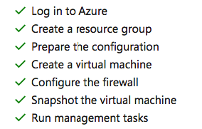
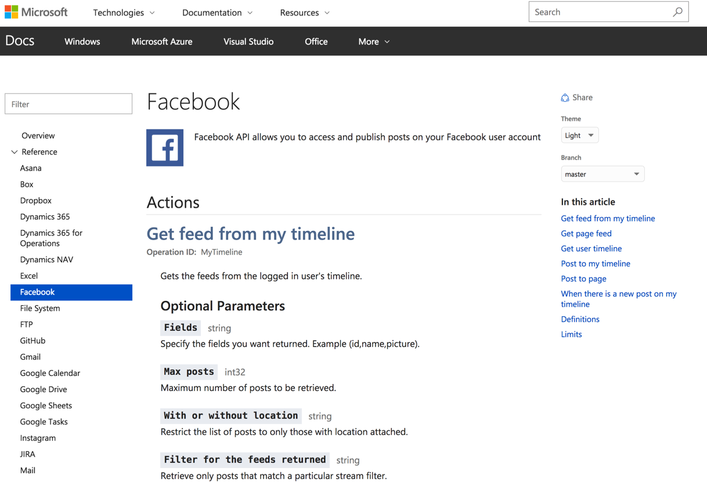
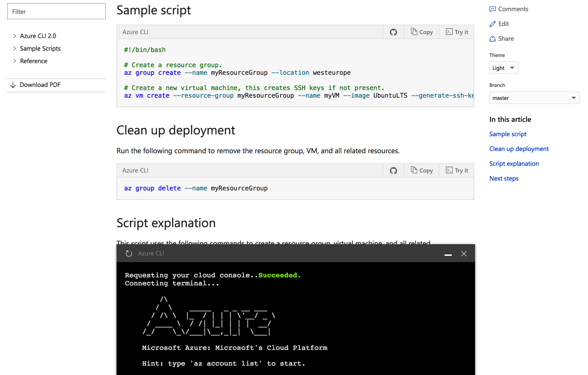
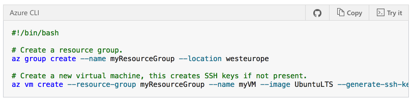
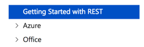

***Microsoft Confidential***
# APEX Sprint 117 Summary Report

Sprint Dates:  04/17/2017 - 05/05/2017

Deployment Date:  05/08/2017


Welcome to the APEX Sprint Summary Report for Sprint 117. We're in a good rhythm with our planning and reporting, and the deliverables for this sprint - both in terms of quantity and quality - are reflective of that.  Whether it be the massive support for the Windows content launches on 4/24, the release of some of our internal authoring and productivity tools, or all of the design and engineering work to lead up to //Build next week, we are delivering real value for our customers. 

Behind the scenes we are continuing to expand our integration across the org, and while this summary report will be a visible artifact of that, the more important element is that we are changing how we work to be more transparent, more inclusive, and more efficient.  

And with that, I encourage you to read thru the summaries below and to drill into the details.  

> [!NOTE]
> You can remove yourself from the distribution list by clicking on the unsubscribe link.  Similarly, you are welcome to forward this to any internal partners or stakeholders that you think would value the updates, and they can add themselves to the distribution by selecting the subscribe link.


|Click for live URL!  |Go live date  |Contacts  |Group  |
|---------|---------|---------|---------|
|[IIS - ENU](https://docs.microsoft.com/en-us/iis/)     |4/20/2017  |Sourabh Shirhatti<br>Sandra Aldana|C+E |
|[Windows Server 2016](https://docs.microsoft.com/en-us/windows-server/windows-server-2016) |4/24/2017  |Dina Bennett<br> Paulina Cortes|Windows |
|[Windows 10](https://docs.microsoft.com/en-us/windows/windows-10/)    |4/24/2017  |Dina Bennett<br> Paulina Cortes|Windows |
|[Windows Education](https://docs.microsoft.com/en-us/education/windows/)     |4/24/2017  |Dina Bennett<br> Paulina Cortes|Windows |
|[Microsoft Store for Business](https://docs.microsoft.com/en-us/microsoft-store/)   |4/24/2017  |Dina Bennett<br> Paulina Cortes|Windows |
|[Microsoft Store for Education](https://docs.microsoft.com/en-us/microsoft-store/index?toc=/microsoft-store/education/toc.json)  |4/24/2017  |Dina Bennett<br> Paulina Cortes|Windows |
|[Microsoft Edge](https://docs.microsoft.com/en-us/microsoft-edge/deploy/)    |4/24/2017  |Dina Bennett<br> Paulina Cortes|Windows |
|[Surface](https://docs.microsoft.com/en-us/surface/)     |4/24/2017  |Dina Bennett<br> Paulina Cortes|Windows |
|[Surface Hub](https://docs.microsoft.com/en-us/surface-hub/)     |4/24/2017  |Dina Bennett<br> Paulina Cortes|Windows |
|[Hololens](https://docs.microsoft.com/en-us/hololens/)     |4/24/2017  |Dina Bennett<br> Paulina Cortes|Windows |
|[Dynamics Customer Engagement- ENU](https://docs.microsoft.com/en-us/dynamics365/customer-engagement/gamification/index)     |4/25/2017  |Buckley Guderian<br>Sandra Aldana|Dynamics (C+E) |
|[Windows Hardware Drivers](https://docs.microsoft.com/en-us/windows-hardware/drivers/)     |4/26/2017  |Ted Hudek <br> Paulina Cortes|Windows |
|[Bot Framework (conceptual)](https://docs.microsoft.com/en-us/bot-framework/)     |4/26/2017  |Robert Standefer <br> Sudeep Kumar| AI & Research|
|[Intune for Education](https://docs.microsoft.com/en-us/intune-education/)     |5/02/2017  |Mike Tillman <br> Sudeep Kumar|C+E |


|Click for details!  |VSTS  |Owners  |Impact  |
|---------|---------|---------|---------|
|[Gauntlet Release to Production](#gauntlet-release-to-production) |  |Megan Bradley (PM)<br>Martin O'Flaherty (PM)<br>Jonathan Duncan's team (Dev)|docs.microsoft.com contributors. |
|[S117 Docs UX Changes](#s117-docs-ux-changes) | [971039](https://mseng.visualstudio.com/DefaultCollection/CSI/_workitems?id=971039) <br> [891858](https://mseng.visualstudio.com/DefaultCollection/CSI/_workitems?id=891858) <br> [980254](https://mseng.visualstudio.com/DefaultCollection/CSI/_workitems?id=980254) <br> [966256](https://mseng.visualstudio.com/DefaultCollection/CSI/_workitems?id=966256)| Rob Eisenberg (PM) <br> Brady Gaster (PM) <br> Duncan Mackenzie (Dev) <br> Adam Kinney (Dev)  <br> Geoff Knutzen (Dev) |   End Users      |
|[Azure Cloud Shell](#azure-cloud-shell) |[656324](https://mseng.visualstudio.com/DefaultCollection/CSI/_workitems?id=656324)| Rob Eisenberg (PM) <br> Jerry Song (Dev) <br> Jeremy Danyow (Dev)| Azure Users         |
|[Enhanced Code Samples](#enhanced-code-samples)|[953670](https://mseng.visualstudio.com/DefaultCollection/CSI/_workitems?id=953670)| Rob Eisenberg (PM) <br> Zhenghui Yan (Dev) <br> Jeremy Danyow (Dev) | End Users         |
|[Fusion TOC for .NET](#fusion-toc-for-net) |[953840](https://mseng.visualstudio.com/DefaultCollection/CSI/_workitems?id=953840) | Brady Gaster (PM) <br> Tianqi Zhang (Dev) <br>  Geoff Knutzen (Dev) | Azure .NET Users |
|[Fusion TOC for Java](#fusion-toc-for-java)|[953842](https://mseng.visualstudio.com/DefaultCollection/CSI/_workitems?id=953842)  | Yun Lu (PM) <br> Xuan Zhou (Dev)        |   Azure Java Users      |
|[REST: Emulate MVC TOC structure for partners](#rest-emulate-mvc-toc-structure-for-partners)| [965415](https://mseng.visualstudio.com/DefaultCollection/CSI/_workitems?id=965415)| Brady Gaster (PM) <br> Jessie Huang (Dev) |  REST Users       |
|[PowerShell: Follow-ups from March release](#powershell-follow-ups-from-april-release)| [968803](https://mseng.visualstudio.com/DefaultCollection/CSI/_workitems?id=968803) <br> [966465](https://mseng.visualstudio.com/DefaultCollection/CSI/_workitems?id=966465) | Sanketh Arvapally (PM) <br> Qinen Zhu (Dev) |  Azure PowerShell Users       |
|[Support for current loc pipe](#support-for-current-loc-pipe)  | [965397](https://mseng.visualstudio.com/DefaultCollection/CSI/_workitems?id=965397&_a=edit&triage=true) <br> [949051](https://mseng.visualstudio.com/DefaultCollection/CSI/_workitems?id=949051&_a=edit&triage=true) | Sonja Saltzman (PM) <br> Qin Mu (Dev) | Loc PMs    |
|[Support for new loc pipe](#support-for-new-loc-pipe)    | [954679](https://mseng.visualstudio.com/DefaultCollection/CSI/_workitems?id=954679&_a=edit&triage=true) <br> [966171](https://mseng.visualstudio.com/DefaultCollection/CSI/_workitems?id=966171&_a=edit&triage=true>) <br> [937953](https://mseng.visualstudio.com/DefaultCollection/CSI/_workitems?id=937953&_a=edit&triage=true) <br> [949052](https://mseng.visualstudio.com/DefaultCollection/CSI/_workitems?id=949052&_a=edit&triage=true) |  Sonja Saltzman (PM) <br> Osmond Jiang (Dev) <br> Qin Mu (Dev)        |  Loc PMs |
|[New LiveFyre notification options](#new-livefyre-notification-options)    | [945997](https://mseng.visualstudio.com/DefaultCollection/CSI/_workitems?id=945997) <br> [945999](https://mseng.visualstudio.com/DefaultCollection/CSI/_workitems?id=945999)         | APEX DS team       | Content owners         | 
|[New reports for video clicks, SEO data, and monikers](#new-reports-for-video-clicks-seo-data-and-monikers)   | [937476](https://mseng.visualstudio.com/DefaultCollection/CSI/_workitems?id=937476)          | APEX DS team       | Content owners        |
|[New data pipeline for usability studies](#new-data-pipeline-for-usability-studies)   | [951415](https://mseng.visualstudio.com/DefaultCollection/CSI/_workitems?id=951415)           | APEX DS team        | Content owners        |
|[Updates to SkyEye data processing](#updates-to-skyeye-data-processing)    |         | APEX DS team          | Content owners        |
|[Experimentation for Writers V2](#experimentation-for-writers-v2)    |  [981516](https://mseng.visualstudio.com/CSI/_workitems/edit/981516) <br> [981554](https://mseng.visualstudio.com/CSI/_workitems/edit/981554) <br>  [968171](https://mseng.visualstudio.com/CSI/_workitems/edit/968171) <br> [955790](https://mseng.visualstudio.com/CSI/_workitems/edit/955790)  | Saurabh Choudhury (PM) <br> Ricky Kurniawan (Dev) <br> Sarah Baranowski (Researcher) | Content owners        |


Content listed here is just up to //BUILD conference with the exception of Mooncake given its visibility.

Full query of upcoming content releases is [here](https://mseng.visualstudio.com/CSI/_queries?id=3c45d380-9fe3-4fd3-90e9-6a994e1b703a&_a=query). 

|Release |Target date  |Contacts  |Group  |
|---------|---------|---------|---------|
|[Springfield-MSRD Dev Center](https://review.docs.microsoft.com/en-us/security-risk-detection)| 5/5/2017| Dave Tamasi <br> Sanketh Arvapally| MSRD Dev Center|
|[Outlook - ENU](https://review.docs.microsoft.com/en-us/outlook/)  | 5/5/2017  |   Shreedevi Padmasini <br>Sandra Aldana       | Office       |
|[Resource Health REST API](https://review.docs.microsoft.com/en-us/rest/api/resourcehealth/?branch=resourcehealth)| 5/5/2017| Rajitha Pulluri <br> Sanketh Arvapally| Azure|
|[Cognitive Toolkit - Conceptual](https://review.docs.microsoft.com/en-us/cognitive-toolkit)| 5/8/2017| Dave Ahlers <br> Sanketh Arvapally| Cognitive Toolkit|
|[Connectors](https://review.docs.microsoft.com/en-us/connectors/)<br>[More details](#connectors)| 5/8/2017| Asavari Tayal <br> Brady Gaster <br> Saurabh Choudhury <br> Sanketh Arvapally | Connectors|
|[HealthVault - ENU](https://review.docs.microsoft.com/en-us/healthvault/?branch=master) |  5/10/2017 | Justin Hutchins<br>Sandra Aldana   |  HealthVault  |
|[Mooncake](https://review.docs.azure.cn/en-us/) |  6/19/2017   | Johnny V Chen <br> Hui Xie | Azure |


|Click for details!  |VSTS  |Owners  |Impact  |
|---------|---------|---------|---------|
|[PRMerger Gauntlet integration (dogfood)](#prmerger-gauntlet-integration) |[796423](https://mseng.visualstudio.com/CSI/_workitems?id=796423&_a=edit&triage=true)|Eman Shaheen (PM)<br>Martin O'Flaherty (PM)<br>Davanand Bahall (Dev)|Writers, other contributors |
|[Gauntlet Metadata Validation (dogfood)](#gauntlet-metadata-validation) |[658002](https://mseng.visualstudio.com/DefaultCollection/CSI/_workitems?id=658002&_a=edit&triage=true)|Sudeep Kumar (PM)<br>Megan Bradley (PM)<br>Peter Ibekwe (Dev)<br>Petr Abraham (Dev)  |Writers, BI team  |
|[Markdown: Content Switcher](#markdown-content-switcher)| [710460](https://mseng.visualstudio.com/DefaultCollection/CSI/_workitems?id=710460) | Rob Eisenberg (PM)  | Writers |
|[OPS Portal and Provisioning Updates](#ops-portal-and-provisioning-updates) | [951488](https://mseng.visualstudio.com/DefaultCollection/CSI/_workitems?id=951488) | Sandra Aldana Abad (PM) <br> Feng Xu (Dev) <br> Jason Zhu (Dev)| Content Repo admin, OPM |
|[Support CNTK Python API Documentation](#support-cntk-python-api-documentation)| [953165](https://mseng.visualstudio.com/DefaultCollection/CSI/_workitems?id=953165) | Yun Lu (PM) <br> Renze Yu (Dev) <br> Jinheng Wang (Dev) | CNTK Python Users        |
|[Constructors: Sample Validation Infrastructure](#constructors-sample-validation-infrastructure) | [796304](https://mseng.visualstudio.com/DefaultCollection/CSI/_workitems?id=796304) | Den Delimarschi (PM) <br> Yufei Huang (Dev) | End Users   |
|[Conceptual Versioning](#conceptual-versioning) | [953675](https://mseng.visualstudio.com/DefaultCollection/CSI/_workitems?id=953675) | Rob Eisenberg (PM) <br> Zhiliang Xu (Dev) | Writers, End Users |
|[File Level Publish for Loc](#file-level-publish-for-loc)  | [769889](https://mseng.visualstudio.com/DefaultCollection/CSI/_workitems?id=769889&_a=edit&triage=true)   | Sonja Saltzman (PM) <br> Ying Hua | Loc PMs, Testers, End Users |
|[Bilingual Loc for New Pipe](#bilingual-loc-for-new-pipe)  | [950241](https://mseng.visualstudio.com/DefaultCollection/CSI/_workitems?id=950241&_a=edit&triage=true) | Sonja Saltzman (PM) <br> Osmond Jiang (Dev)        | End Users   |
|[Validate YML Header Before XLiff Creation](#validate-yml-header-before-xliff-creation)| [985621](https://mseng.visualstudio.com/DefaultCollection/CSI/_workitems?id=985621&_a=edit&triage=true)  |Sonja Saltzman (PM) <br> Yufei Huang (Dev)| Loc PMs, End Users|
|[Do Not Delete Referenced Localized Art in New Pipe](#do-not-delete-referenced-localized-art-in-new-pipe)| [950832](https://mseng.visualstudio.com/DefaultCollection/CSI/_workitems?id=950832&_a=edit&triage=true)   | Sonja Saltzman (PM) <br> Osmond Jiang (Dev)  | Loc PMs, Testers, End Users        |
| [AFD Integration and Audience Segmentation](https://review.docs.microsoft.com/en-us/new-hope/specs/experimentation/audience%20segmentation) | [945741](https://mseng.visualstudio.com/CSI/_workitems?id=945741)| Saurabh Choudhury (PM) <br> Ricky Kurniawan (Dev) Simon Wu (Dev) <br> Sarah Baranowski (Researcher) | Writers and PMs| 
| [Feature Experimentation](https://review.docs.microsoft.com/en-us/new-hope/specs/experimentation/audience%20segmentation) | [945744](https://mseng.visualstudio.com/CSI/_queries?_a=edit&id=945744&triage=true)| Saurabh Choudhury (PM) <br> Ricky Kurniawan (Dev) Simon Wu (Dev) <br> Sarah Baranowski (Researcher) | PMs| 


- [OPS Yammer Group](https://www.yammer.com/microsoft.com/#/threads/inGroup?type=in_group&feedId=7133984)
- [OPS Docs](https://opsdocs.azurewebsites.net/en-us/opsdocs/index?branch=master)
- [DRAFT Onboarding guides](https://review.docs.microsoft.com/en-us/help/contribute/)
- [Live Site Weekly Reports](https://opsdocs.azurewebsites.net/en-us/OPSDocs/livesiteupdates/?branch=master)
- DL: Join [this group](http://idwebelements/GroupManagement.aspx?Group=ceapexsprint&Operation=join) to subscribe to this sprint summary!
 


## Gauntlet Release to Production

The Gauntlet authoring services and VS Code extension released to production on April 25. Gauntlet provides Markdown authoring assistance to writers working in OPS and publishing to docs.microsoft.com. It includes several functions, such as applying templates to new Markdown files, applying common formatting to strings, and inserting links, images, tokens, snippets, tables, and lists, as well as previewing content using your site's CSS. Any Microsoft employee working in Markdown and publishing to docs.microsoft.com can install and use Gauntlet.

**More info**<br>
[Gauntlet Home](http://aka.ms/Gauntlet)<br>
[http://aka.ms/GauntletDocs](http://aka.ms/GauntletDocs)<br>
Questions? Want to be a dogfooder for new features? Email gauntletPM@microsoft.com.

***

## PRMerger Gauntlet Integration

The current PRMerger tool, which provides automated pull request review and merging if certain criteria are met, has been integrated into Gauntlet and will enter UAT with a pilot project in Sprint 118. Once UAT has been passed, PR Merger (which is currently only available for Azure) will be rolled out to other content sets.

**More info:**<br>
[See spec](https://microsoft.sharepoint.com/teams/CE_CSI/Shared%20Documents/Forms/AllItems.aspx?FolderCTID=0x01200069E461F37D24AD49B04A7C2B9F4D0BB3&View=%7b7E31666A-8D21-43CF-8574-931DB14C10DB%7d&id=/teams/CE_CSI/Shared%20Documents/CSI%20Spec%20Library/PRMERGER2/PRMerger2_Requirements.docx&sortField=Editor&isAscending=true&parent=/teams/CE_CSI/Shared%20Documents/CSI%20Spec%20Library/PRMERGER2)

***

## Gauntlet Metadata Validation

The first Gauntlet validation feature is metadata validation, including BI metadata and SEO metadata. The feature will release the second week of May to a limited set of dogfooders, and is expected to release to production toward the end of May. When released, content team admins will be able to configure validation rules in the Gauntlet web UI, and writers and other contributors will be able to validate their files via the Gauntlet VS Code extension.

Additional validations, including Markdown and HTML content validation, are in expected to release toward the end of Q4.

**More info:**<br>
[See spec](https://microsoft.sharepoint.com/teams/CE_CSI/_layouts/15/WopiFrame.aspx?sourcedoc=%7B11C4D8DA-4D1E-4E70-96AC-3F6A46006DBA%7D&file=Meta%20Data%20Validation%20Functional%20Spec.docx&action=default)<br>
Questions? Want to be a dogfooder for new features? Email gauntletPM@microsoft.com.

## S117 Docs UX Changes

### Check Mark Styling

A new style is now available for bulleted lists. You can render lists with checkmarks. Here's an example of what it will look like:



To render the above list, you would write the following Markdown:

```markdown
> [!div class="checklist"]
> * Log in to Azure
> * Create a resource group
> * Prepare the configuration
> * Create a virtual machine
> * Configure the firewall
> * Snapshot the virtual machine
> * Run management tasks
```

While this new Markdown extension can be used anywhere, we recommend that you target this towards the "What will you learn" (at the top of an article) or "What have you learned" (at the end of an article) scenarios, where you want to vividly point out to customers key points they will learn in an article or tutorial. Please refrain from adding random or adhoc checked lists throughout your articles.

[A demo of the Check Mark Styling feature is available here.](https://review.docs.microsoft.com/en-us/new-hope/resources/s117-docs-ux?branch=master#checked-lists)

### Next Step Action

We're rolling out a new Markdown extension targeted at providing a consistent way for writers to show a next step action at the end of their articles. Here's what it will look like:


To render the above action, you would write the following Markdown:

```markdown
> [!div class="nextstepaction"]
> [Create and Manage VM disks](https://docs.microsoft.com/en-us/azure/virtual-machines/linux/tutorial-manage-disks)
```

Please use this Markdown extension only at the end of your articles, with the explicit intent to guide readers to a next article that they should read after their currently viewed article. Please do not use this extension in any other way.

[A demo of the Next Step Action feature is available here.](https://review.docs.microsoft.com/en-us/new-hope/resources/s117-docs-ux?branch=master#next-step-action)

### Hub/Landing Pages Updates

As part of this release we're rolling out a collection of new Landing Page designs along with updated content for Azure. There are 20 new langing pages in total, all related to Azure content. An important aspect of these new landing pages is that they are data-driven, based on a Yaml file format. This massively improves the process of creating and maintaining landing pages going forward. We estimate an annual production cost savings of about one quarter of a million dollars once we roll this out across all landing and hub pages.

### 404 Page

We're working on a new 404 page for docs that provides a modern, fun experience for our customers. We'll be meeting with leadership during the next sprint to approve the final approach, polish it and make a plan to ship it. Stay tuned for more information and get your gamepads ready...

### Connectors

The PowerApps/PowerFlow Connectors team describes all of their Connectors using Swagger/OAI syntax, which they extend using a combination of JSON and XML files. The Connectors team came to APEX and expressed interest in working with us to devise a template strategy that they could not only use to generate their documentation, but that they could own moving forward. Working closely with APEX UX developers, we used the new dynamic model support in our recent YAML model improvements to support the Connectors' team's new format, which serves a new docs.microsoft.com persona - the business user getting to know PowerApps who needs a "lighter reference" material describing each Connector's feature. 



**More info**<br>
The Connectors documentation set can be seen [here](https://review.docs.microsoft.com/en-us/businessplatform/connectors/).

***

## Azure Cloud Shell

We now have the ability to enable Azure CLI code samples to be run directly from within docs.microsoft.com. Code samples for which this is enabled will now have a "Try It" button. Clicking that button will display the Azure Cloud Shell at the bottom of the screen. Here's an example of how that looks:



The integration we've built facilitates an authentication for customers so that *they can only run commands against their own Azure account.* This work has been done as part of a cross-org collaboration with the Azure Cloud Shell team. We've also talked with CELA in order to get proper notifications in place around Azure consumption charges.

To turn this feature on for a particular code block, you must use the language `azurecli-interactive` instead of `azurecli` for that code block.

In the future, we hope to enable more CLI and REPL experiences within docs by partnering with teams across Microsoft.

[A demo of the Azure Cloud Shell feature is available here.](https://review.docs.microsoft.com/en-us/new-hope/resources/s117-docs-ux?branch=master#azure-cloud-shell)

***

## Enhanced Code Samples

In addition to the Cloud Shell work, we've now enabled all `include`-style code blocks to automatically link to their source on GitHub. If you use an `include`, the GitHub source link will now automatically be displayed with your code. Here's what that will look like:



No further action is needed on the part of content authors to take advantage of this update. As a reminder, it is only available for code includes, not GFM triple backtick. We encourage *all* content authors to move code samples to the `include` format if possible.

***

## Fusion TOC for .NET and Java

Our goal with the fusion TOC is to integrate relevant _Getting Started_ content into the reference experience, as well as integrate relevant reference entries in conceptual content. In addition, the goal of the fusion TOC is to organize content holistically, grouping reference entities by Azure service and showing them in one TOC. By bringing the "service-centric" TOC organization structure, our reference experiences for Azure are consistent across PowerShell, CLI, and now the Java and .NET SDK reference sites.

### Fusion TOC Staging Sites

- [Java](https://review.docs.microsoft.com/en-us/java/azure/overview?branch=fusion-toc-split)
- [.NET](https://review.docs.microsoft.com/en-us/dotnet/azure/overview?view=azuremgmtappservice-fluent-1.0.0&branch=fusionTOC)

**More info**<br>
[Spec of Fusion TOC for .NET & Java](https://review.docs.microsoft.com/en-us/new-hope/specs/reference/net-and-java-fusion-tocs)

***

## REST Improvements

We made significant improvements during S117 around re-organizing the REST API reference TOC so that individual APIs could be better organized when they have both reference and conceptual content. 

### Emulate MVC TOC Structure

Each top-level TOC node of the REST API site, like App Service, Analysis Services, or Redis Cache, already supports both conceptual and reference links via an existing mapping file usage. However, this mapping file doesn't stitch the TOC together consistently and in some cases, not even alphabetically. With this feature, the REST API reference will mirror the TOC structure of the Azure CLI and PowerShell references. This feature will extend the mapping file and hybrid TOC capabilities and unify the experience with our other sites.

### Enable Non-Azure Products
During S117, the TOC work resulted in our ability to **onboard non-Azure partners to the REST API reference**, so product groups like HealthVault, Office, and Bot Framework will be enabled as well. We have some additional tweaks we plan to make during S118 that will make mapping file management easier and up-level the main index.md file for the REST API reference, but post-S118 all Microsoft product groups will be able to onboard to the REST API reference provided they have Swagger/OAI documents that can be ingested. 



**More info**<br>
[Here is the spec](https://review.docs.microsoft.com/en-us/new-hope/specs/reference/rest-mvc-toc?branch=master) for this feature.

***

## PowerShell: Follow-ups from PowerShell March Release

The following features have been addressed in this sprint: 
1. [968803:Redirect contribution to source code repo](https://mseng.visualstudio.com/CSI/_queries?_a=edit&id=968803&triage=true) - Contributions on cmdlets ref mds will now be forwarded to azure/azure-powershell src code repo for modules/cmdlet within Resource Manager.
2. [966465: Enable support for conceptual docs by version](https://mseng.visualstudio.com/CSI/_queries?_a=edit&id=966465&triage=true) - The ability to have conceptual docs by moniker version aka azure powershell release version.  

***

## Markdown: Content Switcher

We're working on a new feature that would enable writers to created "tabbed" content, enabling customers to read different "flavors" of the same topic. Imagine that you want to teach someone how to create a virtual machine. Your readers may want to do that with PowerShell, the Azure CLI or the Azure Portal. Today this content has to be split across multiple articles and there is no way to share content between them. Thd Content Switch feature will address these issues.

**More info**<br>
[The Content Switcher Spec Draft is Available Here](https://review.docs.microsoft.com/en-us/new-hope/specs/conceptual/tabbed-conceptual)

***

## OPS Portal and Provisioning Updates

We noticed that some users who were moving OPS repos across organizations did not do the final step, so OPS webhooks were broken and content could not build. Thus, we added an additional warning message when users try to leave the tranferring window as well as we increased the session time out from 1 to 3 hours.

We continue working on enabling users to self-configure robot accounts to their repos for PR validation and builds. If users do not specify one, we also allow users to default to OPS robot build account. This feature is still in progress. 

**More info**<br>
[OPS Portal](https://OPS.microsoft.com)

***

## Support CNTK Python API Documentation

The Python API documentation is not currently hosted on docs.ms.com. DocFX reference materials so far doesn’t support generating any Python API documentation. Eric Holscher from Read the Docs builds a Sphinx-DocFX-YAML converter which can convert python API to DocFX readable YML files. DocFX will consume these YML files to generate Python API documentation to docs.ms.com.      
In S117, we are working on a new DocFX document processor which aims to support multiple languages like Python, JavaScript, C# and so on. and using this processor to generate CNTK python API documentation to docs.microsoft.com.

**More info**<br>
[Spec of CNTK Python API docs](https://microsoft.sharepoint.com/teams/CE_CSI/Shared%20Documents/Forms/AllItems.aspx?id=/teams/CE_CSI/Shared%20Documents/CSI%20Spec%20Library/DotNet%20Reference/CNTK-python.docx&parent=/teams/CE_CSI/Shared%20Documents/CSI%20Spec%20Library/DotNet%20Reference)

***

## Constructors: Sample Validation Infrastructure

Constructors is an effort to democratize sample testing and ensure that all sample code shipped by Microsoft is always in a usable state for our customers.

**More info**<br>
In this sprint we did a deep-dive into the state of VSTS and how we can best integrate our scenarios in a way that makes it easy to onboard and maintain existing repositories. We are in the process of setting up the validation for a set of Azure samples - this will involve working closely with our partners, determining the focus areas and test-flighting the infrastructure.

We are investigating how it's best to integrate a Docker-ized workflow into the VSTS CI, to make sure that we can get coverage for the most important areas. As of today, there is a number of limitations that we need to account for, such as restrictions related to the Windows Server Core (nano server) and provisioning VMs. Continued work in this area will happen in the next sprints, as well as onboarding more repositories.

***

## Conceptual Versioning

We first started rolling out versioning of reference content during our last sprint, as part of the .NET API Browser and PowerShell reference work. We're now working towards enabling broad support for versioning of conceptual content. We're building this on top of the work done for reference and extending it to handle the unique challenges around conceptual. This work will take multiple sprints to roll out in full. We're currently putting together an implementation strategy so that we can get a minimal solution out early and expand it to handle more advanced scenarios over time.

**More info**<br>
[The Conceptual Versioning Spec is Available Here](https://review.docs.microsoft.com/en-us/new-hope/specs/ops/conceptual-versioning)

***

## Support for Current Loc Pipe

Contains multiple features:
- Support for AND and CONTAINS operators in the OpenLoc localization config to support complex project requirements
- Add ms.contentlocale and ms.translationtype metadata


***

## Support for New Loc Pipe

Contains multiple features:
- To support migration from the old pipe to the new tooling pipe without needing to handoff all files, OL will provide a migration file containing the file status for each locale, so it can be properly set in iCMS
- Support for force handoff via UI by users; user can set a file to re-index which forces a new xliff to be generated and available for handoff
- Add ms.lasthandoff metadata to loc files for feature parity with old pipe
- Add ms.contentlocale and ms.translationtype metadata

***

## File Level Publish for Loc

Currently loc files are handed back as a batch, and one bad file prevents publishing of all files in that batch. This feature allows single-file level errors, and also allows loc PMs to configure which errors block the build or not. May go over 2 sprints to be completed.

***

## Bilingual Loc for New Pipe

Enabling bilingual localization (a.k.a. SxS) in the new localization pipe.

***

## Validate YML Header Before XLiff Creation

Currently files are transformed to xliff even with invalid yml headers. Files are then localized and handed back, but cannot be re-transformed to markdown. This feature prevents handoff of files with invalid yml headers, plus generation of error message, so the file can be fixed first.

***

## Do Not Delete Referenced Localized Art in New Pipe

Achieves feature parity with existing pipe. Localization is usually at a delta (due to translation time, loc files are 1-2 weeks "behind" english versions). When a writer deletes an image, OpenLoc deletes the localized image in the loc repos, even though the loc file may still be handed back and require that image for publishing. When the image is deleted, the published page displays broken art. This feature prevents this.

*** 

## New LiveFyre Notification Options

SkyEye users can now request LiveFyre [notifications](http://aka.ms/skyeye/notification) for all pages in a service, and can get notifications sent to aliases as well as individual e-mail addresses.

***
## New Reports for Video Clicks, SEO Data, and Monikers

New SkyEye reports are available: 
- [Video clicks](https://msit.powerbi.com/groups/me/reports/ae9091ed-6c08-45f3-8cd0-07ef1af610ef/ReportSection) on Azure hub page and MVC landing page
- Docs [monikers](https://msit.powerbi.com/groups/me/dashboards/91bb4b60-d7b2-42d6-b815-d0c566528a71/reports/f03d27e0-4181-4c1d-aebb-b1f28100da26/ReportSection24)
- [SEO](https://msit.powerbi.com/groups/me/reports/81aa43ae-2df4-4dd8-8c76-0c83b1a11a6e/ReportSection1)


***
## New Data Pipeline for Usability Studies

A daily ingestion process has been set up to pick up usability report files from SharePoint and upload the data to SQL Database.  This work will enable future reporting on usability studies.


***
## Updates to SkyEye Data Processing

The processing of SkyEye web analytics data has been moved upstream to Cosmos for improved scalability and cost efficiency over time.

***
## Experimentation for Writers V2

We launched a new version of [experimentation platform](http://skyeyereports.cloudapp.net/experiment?id=e24fc21f-f6cb-41) based on the feedback from the writers. Here are updates to the new platform:
1.	The writers do not need to provide the path of the markdown files. We auto-detect based on the configured files.
2.	In Before-After experimentation, the writers can use the entire service or product as a control group.
3.	The writers can share a direct link to their experiment for collaboration
4.	The writers can export the data into an excel.
5.	We provide a summary stat on all the experiment at the top of the screen.

***


## LEAVE (Un-subscribe)
http://idwebelements/GroupManagement.aspx?Group=ceapexsprint&Operation=leave 

## JOIN (Subscribe)
http://idwebelements/GroupManagement.aspx?Group=ceapexsprint&Operation=join 
