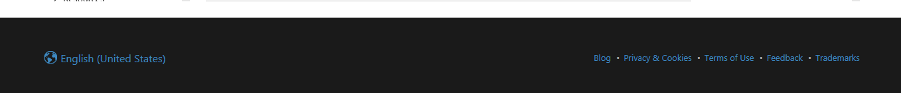
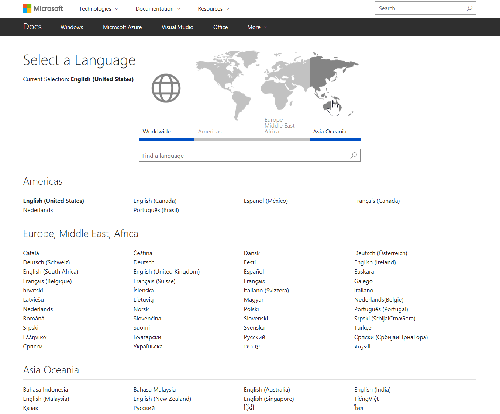

***Microsoft Confidential***

# APEX Sprint 120 Summary Report

Sprint dates:  06/19/2017 - 07/07/2017

Deployment date:  07/10/2017 

## Executive Summary

Sprint 120 saw the release of a number of key content and reference materials, with the [Mooncake](https://docs.azure.cn/zh-cn/#pivot=services) content set being an early highlight. We shipped a number of powerful docs-related features related to samples and user experience, and started work on a number of our multi-sprint features, namely [Conceptual Versioning](#conceptual-versioning). From an International products perspective, there were several release date shifts with all but oone being driven by the product teams. (A retrospective is underway to determine if the volume of changes was an anomaly, or if we have stale data in our workflow.)

Looking ahead to Sprint 121, there is a significant content push on reference content, continued investments in docs experience features, and internal improvements related to author productivity and localization workflow.  From a business standpoint, we will be completing internal reviews of our engineering resource model, specifically our vendor mix, with the goal of improving our efficiency and delivery velocity in Sprint 122 and beyond.

***FY18...here we come!!***

> [!TIP]
> Link to Sprint 121 planning summary is [HERE](https://microsoft.sharepoint.com/teams/CE_CSI/_layouts/15/WopiFrame.aspx?sourcedoc=%7BF6008510-DF75-43ED-BAAF-C92695F20F25%7D&file=FY18Q1Planning-S121Review.xlsx&action=default). This list is provisional and will be updated once the engineering teams have completed their pick-ups. VSTS query for S121 candidate features is [HERE](https://mseng.visualstudio.com/DefaultCollection/CSI/_workitems?id=f6bf2e0d-9b22-4227-96f8-f0422209e642&_a=query).

## Content Summary

This section lists new content releases on our online properties (primarily docs.microsoft.com), the release date, and the content team and PM contacts.  The localized versions of the material are also included when appropriate.

### Released this Sprint

- [Azure Active Directory .NET Reference](https://docs.microsoft.com/en-us/dotnet/api/overview/azure/activedirectory/client?view=azure-dotnet) - 06/16/2017 - Sanketh Arvapally and Den Delimarschi
- [Mooncake](https://docs.azure.cn/zh-cn/#pivot=services) -  6/19/2017 - Sunny Deng, Hui Xie
- [SQL Server 2017 LOC](https://docs.microsoft.com/sql/sql-server/what-s-new-in-sql-server-2017) - 6/20/2017 - Isha Sahni, Sudeep Kumar
- [Azure Cosmos DB .NET Reference](https://docs.microsoft.com/en-us/dotnet/api/overview/azure/cosmosdb/client?view=azure-dotnet) - 06/20/2017 - Sanketh Arvapally and Den Delimarschi
- [Data plane .NET libraries and service landing pages for Storage, Cosmos DB, SQL, Postgres, mySQL](https://docs.microsoft.com/en-us/dotnet/api/overview/azure/?view=azure-dotnet) - 06/21/2017) - Cam Soper, Den Delimarschi
- [Data Plane Java libraries and service landing pages for Storage, Cosmos DB, SQL, Postgres, mySQL](https://docs.microsoft.com/en-us/java/azure/) - 06/21/2017 - Robert Outlaw and Sanketh Arvapally
- [Dynamics Customer Engagement LOC](https://docs.microsoft.com/dynamics365/customer-engagement/gamification/) - 6/22/2017 - Kris Reynolds, Marina Hogan, Sandra Aldana
- [Adaptive Cards](https://docs.microsoft.com/en-us/adaptive-cards/) - 06/26/2017 - Matt Hidinger and Sanketh Arvapally
- [Windows Active Directory .NET](https://docs.microsoft.com/en-us/dotnet/api/microsoft.activedirectory.management.commands?view=activedirectory-management-10.0) - 6/26/2017 - Paulina Cortes & Den Delimarschi
- [Microsoft-R](https://docs.microsoft.com/en-us/r-server/) -  06/29/2017 - Sudeep Kumar, Josée Martens, Heidi Steen

### Upcoming Sprint 121 Content Releases

- [Azure PowerShell v4.2]() - 07/10/2017 - Sean Wheeler, Aaron Rooney and Sanketh Arvapally
- [Gestures](https://review.docs.microsoft.com/en-us/gestures/?branch=master) -07/14/2017 - Yoni Smolin and Sanketh Arvapally
- [Gestures .NET Reference](https://review.docs.microsoft.com/en-us/gestures-dotnet/api/microsoft.gestures?branch=master) - 07/14/2017 - Yoni Smolin and Den Delimarschi
- [Windows Xbox .NET](https://mseng.visualstudio.com/CSI/Onboarding/_queries?_a=edit&id=1012725&triage=true) (Windows) - 7/30/2017 - Paulina Cortes & Den Delimarschi
- [Windows Sysinternals](https://mseng.visualstudio.com/CSI/Onboarding/_queries?_a=edit&id=1012725&triage=true) (Windows) - 7/30/2017 - Paulina Cortes & Luke Kim
- [Team Services .NET](https://review.docs.microsoft.com/en-us/vsts-dotnet/api/microsoft.teamfoundation.framework.common?branch=master) (Visual Studio) - 7/30/2017 - Paulina Cortes & Megan Bradley
- [Team Services REST](https://review.docs.microsoft.com/en-us/rest/vsts/api/?branch=master) (Visual Studio) - 7/30/2017 - Paulina Cortes
- [PowerShell Core Conceptual and Cmdlets Reference](https://mseng.visualstudio.com/CSI/_queries?id=1013561&_a=edit&triage=true) - ~07/31/2017 - JuanPablo, Eric Slesar and Sanketh Arvaplly
- [Powershell Developer content](https://mseng.visualstudio.com/CSI/_queries?id=1025156&_a=edit&triage=true) - ~07/31/2017 - Eric Slesar and Sanketh Arvapally
- [Powershell MREF](https://mseng.visualstudio.com/CSI/_queries?id=1024069&_a=edit&triage=true) - ~07/31/2017 - Eric Slesar and Sanketh Arvapally

## International Product Summary

This section lists the international product releases, the number of languages (in parenthesis), the release date, and the PM contact.

### Released this Sprint

- Stream GA (43) - 6/20/2017 - Khoi Pham
- Team Explorer Everywhere 14.119.02 (OSS Community Loc) (6) - 6/21/2017 - Kevin Liang
- Team Foundation Server 2017 Update 2 RC2 (9) - 6/26/2017 - Praveen Ganapathi Subramanian
- Azure Management Certificates GA (17) - 6/30/2017 - Jian Zhang
- Advanced Threat Analytics (1.8 Client) GA (4) - 6/30/2017 - Chris Niccoli
- Azure Health Public Preview (17) - 6/30/2017 - Daniel Campos
- Azure Active Directory Domain Services Public Preview (17) - 7/4/2017 - Bruno Lewin  
    - **IMPORTANT**: Service is live but announce still pending

> [!NOTE]
> **Azure Container Service Public Preview** (17) (6/28/2017) did not release loc versions due to unsupported formats and build systems with  current Intl pipeline; issues being worked with plan to release localized versions for GA on 7/28/2017.  **Azure Mobile App Preview** (17) (6/30/2017) was postponed to 7/31/2017 due to resource dependencies within product team.  **Azure Active Directory B2C International (Multilingual Support) GA** (38) (6/29/2017) has moved out to fall due to broader quality drive by product team.  **Azure Information Protection (Windows Client Update) GA** (43) (6/30/2017) has moved to 9/3/2017 based on addition of features to previously-planned June release.  **Python Tools for Visual Studio 15.3 RTW** (13) (6/26/2017) release updated to 8/7/2017 based on product team schedule. 

### Upcoming International Product Releases

- Azure App Service on Azure Stack GA (17) - 7/10/2017 - Khoi Pham
- Power BI: PowerQuery for Web (PowerApps/Flow) (43) - 7/10/2017 - Elsa Nitchipor
- SQL Server 2012 Service Pack 4 RTM (10) - 7/11/2017 - Mona Nasr, Khoi Pham
- Team Foundation Server 2017 Update 2 RTM (9) - 7/17/2017 - Praveen Ganapathi Subramanian
- SQL Server 2017 for Windows RC1 (10) - 7/17/2017 - Mona Nasr
- SQL Server 2017 for Linux RC1 (10) - 7/17/2017 - Mona Nasr
- Azure Container Service GA (17) - 7/28/2017 - Daniel Campos
- Azure Mobile App Preview (17) - 7/31/2017 - Jian Zhang
- System Center Configuration Manager 1706 (21) - 7/31/2017 - Haiou Huangfu

## Features Released this Sprint

The following sections list recently shipped features by "Scenario" - that is, by the core APEX "big rock" priority. Each feature links to a feature detail section and includes the VSTS information and the PM/dev contacts.

> = Writer impact - writers, click through to the details section below!

<!-- list key shipped features by scenario - add writer impact icon if appropriate 

-->

### Article and Getting Started Experience

- [Cloud Shell PowerShell Support](#cloud-shell-powershell-support) ([656324](https://mseng.visualstudio.com/CSI/_workitems?id=656324&_a=edit)) - Enhancing Azure PowerShell samples to have the same "Try It" Cloud Console functionality that the Bash samples do today. (Rob Eisenberg/Jeremy Danyow/Chris Johnson)
- [Interactive .NET code REPL](#interactive-net-code-repl) ([656325](https://mseng.visualstudio.com/CSI/_workitems?id=656325&_a=edit)) - Enhancing C# samples to have a similar experience to "Try It" for Cloud Shell. (Rob Eisenberg/Jeremy Danyow)
- [Tabbed Conceptual](#tabbed-conceptual) ([710460](https://mseng.visualstudio.com/CSI/_workitems?id=710460&_a=edit)) - Enabling tabbed content within Markdown articles. (Rob Eisenberg/Jeremy Danyow/Chris Johnson/Zhenghui Yan)
- [Yaml Document Processor Enhancements](#yaml-document-processor-enhancements) ([983782](https://mseng.visualstudio.com/CSI/_workitems?id=983782&_a=edit)) - Enabling full-fidelty, data-driven content generation via Yaml. (Rob Eisenberg/Renze Yu)
- [Support for PDFs for large TOCs](#large-pdfs) ([984628](https://mseng.visualstudio.com/CSI/_workitems?id=984628&_a=edit)) - PDFs can be generated reliably from very large TOCs (Den Delimarschi/Junkui Chen)
- [New Locale Picker Experience](#locale-picker) ([923448](https://mseng.visualstudio.com/CSI/_workitems/edit/923448)) - New experience for selecting the desired locale of docs.microsoft.com (Eman Shaheen, Chris Johnson, Jeremy Danyow)
- Generation of is_significant_update metadata and publish to DHS ([1014834](https://mseng.visualstudio.com/CSI/Ying/_workitems?id=1014834&_a=edit&triage=false)) - Generate and publish is_significant_update metadata for conceptual documents. The metadata will be consumed by RSS feed generator to determine whether a published page would be included in an RSS update (Saurabh Choudhury/Junkui Chen)

### Support All Programming Languages and Samples 

- [Added support for /// imports in frameworks mode (mdoc)](#triple-slash-imports) ([#43](https://github.com/mono/api-doc-tools/issues/43)) - Allow imports for multiple triple-slash comments in managed reference pipeline (Joel Martinez, Den Delimarschi, Craig Dunn)
- [Support for UWP WinMD assembly reflection (mdoc)](#winmd-assembly-reflection) ([#29](https://github.com/mono/api-doc-tools/issues/29)) - Allows the documentation of Universal Windows Platform assemblies (Joel Martinez, Den Delimarschi, Craig Dunn)
- [Support for richer reference links (mdoc)](#richer-ref-links) ([#62](https://github.com/mono/api-doc-tools/issues/62)) - Allows reference documentation authors to include richer links in their /// comments that are then interpreted properly on docs (Joel Martinez, Den Delimarschi, Craig Dunn)

### Improved Content Discovery

*Nothing significant this sprint*

### Writer and Community Contributions

*Nothing significant this sprint*

### Loc Enablement

- [Single file publishing](#single-file-publishing) ([769889](https://mseng.visualstudio.com/CSI/_workitems?id=769889&_a=edit&triage=true)) - Allows localized builds to fail for single files only instead of failing the whole batch (Sonja Saltzman/Zhenghui Yan, Yu Chen)
- [Create MREF loc HO from yaml files](#create-mref-loc-ho-from-yaml-files) ([1003399](https://mseng.visualstudio.com/CSI/_workitems?id=1003399&_a=edit&triage=true)) - Allows loc handoff for mref files from GitHub projects (Sonja Saltzman/Tianqi Zhang, Xuan Zhou, Jason Zhu, Qin Mu, Yufei Huang, Osmond Jiang)
- [Add HostFileTag for MREF files](#add-hostfiletag-for-mref-files) ([1009747](https://mseng.visualstudio.com/CSI/_workitems?id=1009747&_a=edit&triage=true)) - For CEO projects only, OpenLoc pushes HostFileTag information for mref files to iCMS (Sonja Saltzman/Qin Mu)
- [Copy redirection.json to loc repos](#copy-redirection-file-to-loc-repos) ([1013830](https://mseng.visualstudio.com/CSI/_workitems?id=1013830&_a=edit&triage=true)) - Allows users to bulk-copy files from en-us repo to loc repos on demand (Sonja Saltzman/Osmond Jiang)

### Improved Experimentation, Feedback & Analysis

- [Mooncake scorecard implemented in SkyEye](#mooncake-scorecard-implemented-in-SkyEye) ([1003782](https://mseng.visualstudio.com/CSI/_workitems?id=1003782))  (Kalyan C Kesireddy, Ricky Kurniawan)
- [Move to JSLL for Telemetry](#move-to-jsll-for-telemetry) ([967657](https://mseng.visualstudio.com/CSI/_workitems?id=967657&_a=edit)) - Migrating our current site telemetry implementation from WEDCS to JSLL. (Rob Eisenberg/Jeremy Danyow)

### Engineering Excellence

*Nothing significant this sprint*

### Business Continuity

*Nothing significant this sprint*

## Upcoming Features

<!-- list key shipped features by scenario - add writer impact icon if appropriate

-->

### Article and Getting Started Experience

- [Markdown Standardization and Extensibility](#markdown-standardization-and-extensibility) ([923144](https://mseng.visualstudio.com/CSI/_workitems?id=923144&_a=edit)) - Aligning our Markdown parser to GFM CommonMark compatible syntax while providing a Markdown extensibility model. (Rob Eisenberg)
- [Interactive Tutorials](#interactive-tutorials) ([795312](https://mseng.visualstudio.com/CSI/_workitems?id=795312&_a=edit)) - Step-by-step, stateful, tutorial experiences that incorporate interactive components such as the Cloud Shell and .NET REPL. (Rob Eisenberg)
- [Preserve Article Context](#preserve-article-context) ([931391](https://mseng.visualstudio.com/CSI/_workitems?id=931391&_a=edit)) - The next generation of Contextual ToC and Breadcrumbs, designed to clean up docs URLs and be a more extensible mechanism for the future. (Rob Eisenberg)
- [New 404 Page](#new-404-page) ([891858](https://mseng.visualstudio.com/CSI/_workitems?id=891858&_a=edit)) - A stylish, fun and helpful new 404 page for docs. (Rob Eisenberg)

### Support All Programming Languages and Samples

*Nothing to note*

### Improved Content Discovery 

- [Conceptual Versioning](#conceptual-versioning) ([953675](https://mseng.visualstudio.com/CSI/_workitems?id=953675&_a=edit)) - Enabling versioning of conceptual content in conjunction with product release changes. (Rob Eisenberg)

### Writer and Community Contributions

- [Gauntlet Version 2](#gauntlet-version-2) (Megan Bradley/Martin O'Flaherty)

### Loc Enablement

- [Single file publishing](#single-file-publishing) ([769889](https://mseng.visualstudio.com/CSI/_workitems?id=769889&_a=edit&triage=true)) - Additional support for the feature rolled out in s120; this allows localized builds to fail for single files only instead of failing the whole batch (Sonja Saltzman/Zhenghui Yan, Yu Chen, Qin Mu, Jason Zhu)
- [Localized MREF system strings](#localized-mref-system-strings) ([1028327](https://mseng.visualstudio.com/CSI/_workitems?id=1028327&_a=edit&triage=true)) - Currently system strings for mref content are not localized and display in English (Sonja Saltzman/Adam Kinney)
- [Uber/Sub TOC fallback to English](#toc-fallback-to-english) ([989360](https://mseng.visualstudio.com/CSI/_workitems?id=989360&_a=edit&triage=true)) - Enables fallback to English for not-localized ueber and/or sub TOCs (Sonja Saltzman/Ying Hua, George Chen)
- [Xliff transform support for json segments](#xliff-transform-support-for-json-segments) ([1024000](https://mseng.visualstudio.com/CSI/_workitems?id=1024000&_a=edit&triage=true)) - Azure SelfHelp content contains json segments which are currently not translatable (Sonja Saltzman/Yufei Huang)

### Improved Experimentation, Feedback & Analysis

- [Service to support telemetry data joins with Ibiza](#Service-to-support-telemetry-data-joins-with-Ibiza) ([1018385](https://mseng.visualstudio.com/CSI/_workitems?id=1018385)) (Bryan Franz, Kalyan C Kesireddy, Rob Eisenberg, Mike Sampson)
- [Onboarding Channel 9 to SkyEye and filling gaps in ACOM and azure.cn coverage](#Onboarding-Channel-9-to-SkyEye-and-filling-gaps-in-ACOM-coverage) ([1018378](https://mseng.visualstudio.com/CSI/_workitems?id=1018378)) (Ricky Kurniawan, Sergey Moroz)
- [JSLL data pipeline prototype in SkyEye](#JSLL-data-pipeline-prototype-in-SkyEye) ([1017515](https://mseng.visualstudio.com/CSI/_workitems?id=1017515)) (Katya Lazhintseva, Kalyan C Kesireddy)

### Engineering Excellence

- [Schema-based Document Processor](#schema-based-document-processor) ([1001743](https://mseng.visualstudio.com/CSI/_workitems?id=1001743&_a=edit)) - Standarizing docs content schemas (hub/landing/tutorial/reference/context/etc), validation, and transformation of Yaml assets across docs. (Ying Hua/Adam Kinney/Rob Eisenberg)

### Business Continuity 

*Nothing to note*

## Feature Details

### Cloud Shell PowerShell Support

We've enabled Azure PowerShell code samples to be run directly from within docs.microsoft.com. Code samples for which this is enabled will have a "Try It" button. Clicking that button will display the Azure Cloud Shell in PowerShell mode at the bottom of the screen. This work is being done as part of a cross-org collaboration with the Azure Cloud Shell team.

**More info** 

  - Launch Plan - While the docs portion of this feature is ready to ship, the Cloud PowerShell team is not launching the core service until September. As we approach the public release, we'll sync back up with the Cloud PowerShell team to ensure a solid launch across the board.
  - [The Enhanced Code Samples Spec](https://review.docs.microsoft.com/en-us/new-hope/specs/markdown/enhanced-code-samples?branch=master)

***
### Interactive .NET code REPL

We've enabled C# code samples to be run directly from within docs.microsoft.com. Code samples for which this is enabled will have a "Try It" or "Run It" button. Clicking that button will transform the code sample into a live Monoco editor and run the code using the new .NET REPL service. This work is being done as part of a cross-org collaboration with the .NET team.

**More info** 

  - Launch Timing - While the docs portion of this feature is ready to ship, the final release of this feature relates to the .NET team's planned browser experience launch. As we approach the public release, we'll continue to sync with the .NET team to ensure a solid launch across the board.
  - [The Interactive .NET code REPL Spec](https://microsoft.sharepoint.com/teams/CE_CSI/Shared%20Documents/Forms/AllItems.aspx?id=%2Fteams%2FCE%5FCSI%2FShared%20Documents%2FCSI%20Spec%20Library%2FDocs%2FDotNet%2DInteractive%2DRepl%2Edocx&parent=%2Fteams%2FCE%5FCSI%2FShared%20Documents%2FCSI%20Spec%20Library%2FDocs&p=true)

***
### Tabbed Conceptual

Previously, we've had to duplicate large sets of content and fragment our content story because there's no way to represent an article such as "Create a Virtual Machine" without providing multiple articles, one on Bash, one on PowerShell and one on Azure Portal. Similar problems exist for other partners that need to pivot around other factors such as Desktop, Mobile or Web. This feature enables conceptual content that is multi-faceted, such that various sections of a document can contain multiple renderings, each covering the same core concept or task but allowing for customer preferences in tooling, platform, language, etc. to decide what is displayed for reading.

**More info** 

  - Launch Plan - This feature is expected to ship at the end of the current sprint. That said, we've recently discovered an isssue caused by the Loc pipleline. This may slightly delay the feature launch, hopefully by no more than a few days. Documentation on feature usage will be available in the next few days as well, along with content guidance.
  - [The Tabbed Conceptual Spec](https://review.docs.microsoft.com/en-us/new-hope/specs/conceptual/tabbed-conceptual?branch=master)

***
### Yaml Document Processor Enhancements

Improving the Yaml Document Processor capabilities of OPS to a higher fidelity, first-class citizen. Details include:

- Establishing a standard metadata section for all Yaml files
- Enabling URL to Git source file mapping; used by the Edit button and BI
- Linking Git contributor info
- Generating proper document ids; used by BI and commenting systems.

**More info** 

  - Launch Plan - This feature has fully shipped.

***
### Large PDFs

Previously, there were issues where the generated PDFs were only available for small TOCs, where anything significant would delay or break the build. This was especially relevant to PDFs that were created for large managed reference docsets, such as .NET. With the recently implemented change, OPS can now generate PDFs for large tables of contents.

As an example, take a look at the PDF generated for the [System namespace](https://opbuildstorageprod.blob.core.windows.net/output-pdf-files/en-us/VS.core-docs/live/api/_splitted/System.pdf).

### Locale Picker

Docs originally shipped with support for 17 languages, and the user chose the language to view the site (if needed, the site auto-detects based on your browser/OS settings) using a drop down in the footer of the page. This worked well for 17 languages, but we've since grown the language/locale list for docs to 65, and the drop down was not a great UX. Instead we now have a fully seperate page and a link from the footer instead of a drop down. To check it out, [please visit any docs page](https://docs.microsoft.com) and then click on the locale link in the footer. For more info, please view [the spec](https://microsoft.sharepoint.com/teams/CE_CSI/_layouts/15/WopiFrame.aspx?sourcedoc=%7b0F17C7EF-56F8-4818-B28D-07C69E6DB7FD%7d&file=LanguagePickerDesign.docx&action=default&IsList=1&ListId=%7bB6933FC8-6E7E-4E20-86D6-0C963B60B552%7d&ListItemId=2652).

### Triple Slash Imports

**More info** 

With us relying primarily on [`mdoc`](https://github.com/mono/api-doc-tools/releases) as the go-to tool to generate managed reference documentation, we have hit the scale barrier where we have significant amounts of content generated from /// comments in code (that ships within NuGet packages and alongside individual binaries) that cannot be imported simultaneously during the documentation build process. We used a number of unreliable workarounds to push content for specific deadlines, that are now replaced with built-in functionality that allows us to mass-import /// comments into our documentation with minimal negative effect on the build performance and documentation quality.

***
### WinMD Assembly Reflection

When we moved the entire managed reference infrastructure to `mdoc` and ECMAXML, one of the big missing items was support for UWP WinMD assembly reflection - the only supported format was `*.dll` and `*.exe`. With this change, we can now start onboarding UWP-based content on docs,microsoft.com. 

***

### Richer Ref Links

Developers can now embed richer links in their /// comments, to make sure that on docs we can render alternate text instead of just the link itself.

***

### Single File Publishing

Localization typically works in bulk-mode - handoffs contain many files for many locales, and handbacks also contain many files for many locales.  The current batch-mode publishing caused issues for localization; if one file in the handback batch had an error that prevented publishing, the whole batch failed, even if 99% of files were good.  This new feature changes that behavior. Users can specify on a per-repo-basis if they want to go to single-file publishing, in which case all good files will publish, and only files with error will not publish. There will be some additional enhancements to this feature in the next sprint, but it will be usable at the end of sprint 120.
Additional enhancememnts added in s121 are displaying the status "PartiallySucceeded" for builds where 1 or more files failed but the rest successfully published, plus pushing the information back to CEO on a per-file basis (displaying correct success/fail per file in iCMS).

***
### Create MREF loc HO from Yaml files

This feature puts the framework into place for localizating reference files via OpenLoc. It consists of multiple smaller features, for example:
- there is a CI job which will grab yaml files produced during the en-US build and place them into a <projectname>_yml4loc repo
- the xliff-transformer will automatically recognize that the files are mref files (based on a header introduced in the prior step) and will transform the files to xliff
- the localization cycle itself is identical to conceptual content (xliff handoff, localization, handback)
- files are transformed back to localized yaml files, and then built by OPS into Intellisense xml files or published as html on docs.microsoft.com
There are still some issues to be worked out (e.g. how to handoff tokens used in reference content, support for additional languages e.g. Java/Python/Ruby), but the general workflow is in place.

***
### Add HostFileTag for MREF Files

This feature is for CEO only.
In order to let iCMS and the loc supplier know that files are MREF files (vs. conceptual), OpenLoc is pushing an MREFIntellisense host file tag into iCMS, which the user can query on. CEO then supports Intellisense localization with HT quality and remainder of mref files with MT quality.

***
### Copy Redirection File to Loc Repos

The .openpublishing.redirection.json file controls redirection of files in en-us repos. In order to have loc files redirect in the same way as the en-us file, users need to manually copy this file to loc repos; this feature automates this. 

***
### Mooncake scorecard implemented in SkyEye

The Mooncake scorecard has been implemented and is now live [here](http://aka.ms/skyeye/mooncake_scorecard). 
(Kalyan C Kesireddy, Ricky Kurniawan)

***

### Markdown Standardization and Extensibility

The current features of our Markdown parser aren't robust enough to support the needs of building future Markdown extensions that are consistent, scalable, standard, safe and performant. This work re-aligns our Markdown parser by building on top of open source, standardizing on GFM CommonMark syntax/semantics, improving performance and lowering memory usage. The new parser will also enable easier creation of extensions to the Markdown language so that we can more efficiently evolve our conceptual content vocabularly on docs.

**More info** 

  - Release Timing: This is an ongoing effort to improve our core Markdown story. We don't yet have a target release date. This is expected to continue throughout FY18Q1. We're currently forming a launch, migration, testing and communication plan.
  - [The Markdown Standardization and Extensibility Spec](https://review.docs.microsoft.com/en-us/new-hope/specs/markdown/markdown-extensibility?branch=master)

***
### Interactive Tutorials

Today on docs we have only two types of content: reference and conceptual. Reference content isn't geared towards those who are getting started. Conceptual content can meet this need. However, to accomplish a step-by-step process with today's technology, one must construct special sub ToCs resulting in a non-fluid experience that lacks any persistent state tracking or rich interaction. The end result is a degraded getting started experience for the customer.

Interactive Tutorials are a new form of conceptual content that build on our existing foundation. A Tutorial takes a customer through an interactive, step-by-step experience. It features a custom landing page, rich with contextual information related to the Tutorial, an in-page step-by-step process, persistent progress tracking, interactive code editors, CLIs...and more.

**More info** 

  - Release Timing - Engineering work started during S119 and will continue into S121. We have a very early version of this feature viewable in PPE now. We'd like to take S121 to allow writers to create some content in review and work with us to polish the feature for launch at the end of S121 or S122.
  - [The Interactive Tutorials Spec](https://review.docs.microsoft.com/en-us/new-hope/specs/conceptual/interactive-guides?branch=master)

***
### Preserve Article Context

Today, when a customer is on a documentation page with a UHF custom L1 and they perform a search, the search results page does not display the same UHF L1 branding, but falls back to the default docs L1. Likewise, if an article is being displayed in association with a Contextual ToC, then the article's associated UHF L1 is displayed rather than the one associated with the ToC. This causes a brand switch, mid-content. Neither of these scenarios provides the type of consistent experience that we want on docs.microsoft.com.

Additionally, the contextual ToC query string does not also enable the correct breadcrumbs to be displayed. These are handled by two separate query string values, the second of which is often forgotten by the ToC author. This proliferation of query strings presents maintenance problems for content creators. It also results in uglier URLs for customers.

Finally, when combining these contextual items with versioning, ToC creation and management complexity explodes to a degree that is not reasonable for writers.

For these and other reasons, we're making the idea of "context" something that is an explicit part of the docs architecture. Any page will be able to reference a "context" which will allow the docs platform to automatically flow in the correct header, breadcrumbs, ToC and any other contextual data or visualizations. This mechanism cleans up our URLs and provides an extensible system for the future.

**More info** 

  - Release Timing - This feature is strongly tied to work happening on Conceptual Versioning and the Schema-based Document Processor. This work will be done incrementally over the next 2 sprints: 121, and 122.
  - [The Preserve Article Context Spec](https://review.docs.microsoft.com/en-us/new-hope/specs/site-experience/preserving-article-context?branch=master)

***
### New 404 Page

We're working on a new 404 page for docs that provides a modern, fun experience for our customers. We have the initial design complete and are putting it through a second design iteration, based on feedback from content teams.

**More info** 

  - Release Timing - There is no planned release date for this feature currently. Both design and engineering are working on this between other tasks as time allows. We are close to a final design and hope to take the engineering to the next stage soon, hopefully during S122.

***
### Conceptual Versioning

As product teams move through the software lifecycle, they produce new versions that either add to or change the core features and capabilities of their products. In response to these changes, a documentation platform needs to be able to display different versions of documentation corresponding with the different product releases. For technical products, this includes two parts: conceptual content and reference content. This feature covers versioning of conceptual content. During S120, engineering moved ahead with compoments in both OPS and DHS realted to versioning.

**More info** 

  - Release Timing - This work will continue for at least the next 2 sprints: 121 and 122. We hope to ship folder-based versioning at the end of S121 and zone-based versioning at the end of S122. These are liberal time estimates, so please take into consideration the potential for these dates to slip out a bit.
  - [The Conceptual Versioning Spec](https://review.docs.microsoft.com/en-us/new-hope/specs/ops/conceptual-versioning?branch=master)

***
### Gauntlet Version 2

Gauntlet version 2 is finishing UAT and releasing to production. This release includes validation, which enables content team admins to configure validation rules in the Gauntlet web UI, and writers and other contributors to validate their files via the Gauntlet VS Code extension. It also includes the ability to insert bookmark links and Channel 9 and YouTube videos.

A console application to validate a full cloned repo at once will also be available.

**More info** 

[Dogfood docs](http://aka.ms/GauntletDFDocs)

***
### Localized MREF System Strings

There are system strings provided by OPS and used during build time which are currently not localized, e.g. Library, Classes, etc. We will extract and localize them in this sprint.

***
### TOC Fallback to English

Currently, there is no TOC fallback for localization; this means if the TOC file is still in localization, the experience is broken, until the loc PM copies the en-US file to the loc repos manually. It becomes even more complex if loc only localizes a subset of content, or the TOC is complex, consisting of sub and ueber TOCs. This feature will enable fallback to english for any or all missing TOC files.

***
### xliff Transform Support for Json Segments

Azure selfHelp content contains json segments which are currently not localizable; this feature enables localization for the necessary elements.

***
### Service to support telemetry data joins with Ibiza

The new Docs service will be called from the Ibiza portal (once per Ibiza session) - it will send data to Kusto that can then be used to join Ibiza sessions with Docs sessions.  This work will have an impact in multiple ways ways: (a) it will help enable new projects, experiments, and reports that track the "customer journey" between Ibiza and Docs, and (b) it will enable data joins between Docs usage data and Azure usage data for a new subset of users (primarily users who sign into the portal via AAD).. 
(Bryan Franz, Kalyan C Kesireddy, Rob Eisenberg, Mike Sampson)

***
### Onboarding Channel 9 to SkyEye and filling gaps in ACOM coverage]

The Channel 9 site will be added to SkyEye scope.  In addition, SkyEye coverage of azure.microsoft.com and azure.cn will be extended to include all site pages - this will provide a more complete view of the "customer journey" on these sites and enable new data and reporting scenarios. (It will also be helpful to other teams in G+E with interests in ACOM data.) 
(Ricky Kurniawan, Sergey Moroz)

***
### JSLL data pipeline prototype in SkyEye

The Docs site and SkyEye are both moving from WEDCS to JSLL (for site metrics) in the coming months. One important step is to map the JSLL data streams (from Docs) to the current SkyEye architecture, so that the JSLL pipeline can later go live with minimal impact on other SkyEye components.  The plan for the next sprint is to build a prototype pipeline and send sample data to Kusto, so that we can validate it relative to the equivalent WEDCS data. 
(Katya Lazhintseva, Kalyan C Kesireddy)

***
### Schema-based Document Processor

This is a new document processor that will eventually handle all Yaml-based content on docs. It processes content based on strictly defined content schemas. Examples of content types that will be handled include hub pages, landing pages, tutorials, universal reference, article contexts and any new Yaml-based content in the future. The processor will allow us to validate Yaml correctness both in terms of syntax and semantics. We'll also be able to more easily transform Yaml, compose Yaml and localize Yaml.

**More info** 

  - Release Timing - This work will continue throughout FQ18Q1. We hope to ship the first content built on this feature, Article Context, at the end of S122. Pst S122, this feature will continue to evolve aggressively for several sprints, until it can handle all Yaml scenarios.
  - [The Schema-based Document Processor Spec](https://github.com/dotnet/docfx/blob/dev/Documentation/spec/docfx_document_schema.md)

***

## Resources

- [OPS Yammer Group](https://www.yammer.com/microsoft.com/#/threads/inGroup?type=in_group&feedId=7133984)
- [OPS docs](https://opsdocs.azurewebsites.net/en-us/opsdocs/index?branch=master)
- [DRAFT Onboarding guides](https://review.docs.microsoft.com/en-us/help/contribute/)
- DL: Join [this group](http://idwebelements/GroupManagement.aspx?Group=ceapexsprint&Operation=join) to subscribe to this sprint summary!

## LEAVE (Un-subscribe)
http://idwebelements/GroupManagement.aspx?Group=ceapexsprint&Operation=leave 

## JOIN (Subscribe)
http://idwebelements/GroupManagement.aspx?Group=ceapexsprint&Operation=join 

## Send Feedback
[Email APEX Planning Council](mailto:hamms@microsoft.com).
