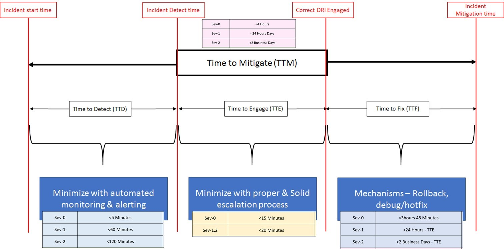

# SLA

##  Production issues' SLA
The following metrics are reviewed in APEX and are key reliability performance indicators across all APEX. Precise measurement and consistent definitions are necessary to maintain the integrity of these measurements. As such, this document is a source of truth for precise TTx and auxiliary metric definitions. Unless stated otherwise, these metrics assume Sev0-2 customer impacting production issues. 

|Severity  |Domain  |Impact Scope | ImpactStatement |Examples  |
|----------|--------|-------------|-----------------|----------|
|0 | Publishing |All repos All Blogs | 100% Of internal partners are impacted|OPS or MTPS is down WP Blog Admin console is down |
|0 | Rendering   | Top level Home pages High Level Security Issues | More than 80% end users are impacted |Docs.microsoft.com Down Developer.microsoft.com Down MSDN, TechNet or Blogs down|
|1 | Publishing  | More than 1 Repo Multiple Topics (Legacy) Multiple Blogs  |More than 30% Internal partners are impacted|Azure Docs & SQL repo having issues OPS portal is down but builds working fine VS bloggers not able to post new blog  |
|1 |Rendering | Supporting or Legacy websites down Security issues with live site |10%-80% end users impacted |Wiki or Forum sites are down|
|2 |Publishing |Single repo Single Topic (Legacy) TOC/DocSet | Less than 30% of internal partners impacted |TOCs for whole product is missing Whole DocSet is having issues|
|2 |Rendering    | Multiple Pages having issues Highly visible controls having issues |Less than 10% end users impacted|Multiple pages throwing 404 |Comment section is erroring out 

### Escalation process
1. All partner escalations will be Severity 0, 1 or 2 depending on above impact statements. Rest all will be raised as bugs.
2. For severity 0 & 1 LSIs
    a. Conf call will immediately be spun, notification will be sent & concern DRI will be called.
    b. Requestor must join the conf call so that mitigation will be quicker. 
3. Severity 2 LSIs will be mitigated over email as per SLA.
4. Depending on root cause, below DRI person will mitigate issue within agreed SLA.
    a. Code issue – Engineering Team
    b. Infrastructure Issue – Site Reliability Engineering Team (AKA Operations team)
    c. Content Issues – Content team.

### TTX SLAs

|Metric |Abbreviation |Severity |North Star (from Event Start unless noted)|Start  |End   |
|-------|-------------|---------|------------------------------------------|-------|------|
|Time to Detect |*TTD | Sev-0 Sev-1 Sev-2 | <5 Minutes <60 Minutes <120 Minutes  |When an incident first affects customers (internal or external)|When the incident is registered in Incident Management Tool (caught by automation or an individual)|
|Time to Triage | TTT |  Sev-0 Sev-1,2       | <5 Minutes <10 Minutes  |When the incident registered|Initial investigation by APEX Live Site Team|
|Time to Escalate | TTEsc | Sev-0 Sev-1,2 |  <15 Minutes <20 Minutes |When the initial investigation completed|Escalated to DRI|
|Time to Engage|*TTE, TTEng   |Sev-0 Sev-1,2 |  <15 Minutes <20 Minutes  |When the DRI acknowledged|Reach out to the actual issue resolver engineer|
|Time to Fix     |*TTF, TTFix     |Sev-0 Sev-1 Sev-2 |<3hours 45 Minutes <24 Hours - TTE <2 Business Days - TTE   |Starts when TTE is complete and actual issue resolver engineer has engaged|When customers are no longer impacted by the event and customer SLA is reestablished|
|Time to Mitigate     |*TTM    | Sev-0 Sev-1 Sev-2   | <4 Hours <24 Hours Days <2 Business Days        |When an incident first affects customers (internal or external)|The sum of TTD+TTE+TTF|
|Time to Internal Notification     | TTN   | Sev 0-1 | <30 Minutes |When an incident first affects customers (internal or external)         |When affected customers are notified of impact|
|Time to External Notification     |  TTEN       | Sev 0        |<30 Minutes       |Only for Sev 0 when major customers are affected|When affected customers are notified of impact|
|% Outages Autodetected     | -         |-         |  66% (Q4-75%)       |The number of outages which were detected that an automated system, triggering ticket creation in Incident Management tool.|The number of outages which were detected that an automated system, triggering ticket creation in Incident Management tool.|

*Aligned with Azure metrics and definition.

