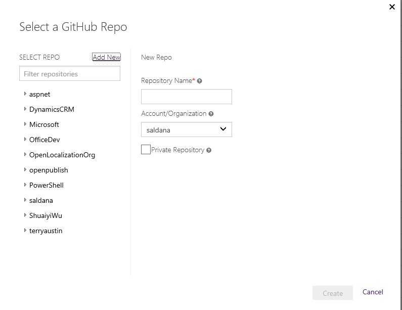
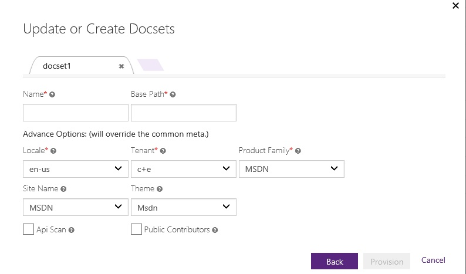

#I want to create a Git and OP repository on portal

In this article, we show you how to create a Git and provision it with OP repository in the OP portal.

This scenario will start from **Create a Git repository for OP create** to **rendering**.

##STEP1: Login with GitHub/VSTS

Go to the [OPS self-service portal](https://OPS).
- For GitHub, sign in with your GitHub alias.
- For VSTS, sign in with your corpnet alias. In the "Authorize application", scroll down and click on "Accept".

> [!IMPORTANT]
> Workflow for VSTS is different. Needs to be reconcile into the same one. 

##STEP2: New Repo

- Click **New & Import Repo** button.
	
	
	
- Click on **Add New** link.
	
	
	
	**Repository Name** - Select a name for your repository. Name can only contain characters, numbers, underline, and hyphen. e.g. "petulant-waffle" is a valid  repository name.
	
	**Account/Organization** - Select a GitHub organization or Visual Studio collection to put your repo in. 
	
	**Private Repository** - Only for GitHub. If you would like your repo to be private, select this option. Be aware of the [OSS policies with regards to private repos](https://www.1eswiki.com/wiki/Choosing_a_Hosting_Provider_For_Your_OSS_Project). 
	
	Click on **Create** once you are done.
	
- Create Common Metadata

    Here you add the metadata for the repository.
	

	- **Locale**: The local of the docset.
	- **Tenant**: The organization you belong to.
	- **Product Family**: `I am still not sure why we need this.`	
	- **Site Name**: The site where you content will be published to.	
	- **Theme**: The theme of the docset. It will determine your header and footer.
	- **Generate PDF**: Select this checkbox if you need to generate a PDF file out of your content.
	- **API Scan** - If your content needs API Scan for compliance, check this box.
	- **Public contributions** - If you would like public contributions once your content goes live, check this box.
	
	Click on **Next**.

	> [!NOTE]
	> Repository validation together with docset can be done after Step 3.

##STEP3: New Docsets

- Operation:

	
	
	In the docsets create view, create one or more docset on the repository you are creating. Note that you can keep the repository metadata or update some for this particular docset. See previous step for a description of the metadata.
		
	- **Name**: The name of the docset. This name needs to be unique across all the OP repos, so try to be specific. So do not create a docset named "Get_started". Instead add your product or service name to it. For example: "VSIDE_get_started".
	- **Base Path**: This is the base URL assigned to the docset. For example "windows/hardware/drivers". The URL of published pages is the combination of site name and base path.

 - To create a new docset, click on the shade area, next to the docset tab. Repeate the steps above.
 
 
 - When you are done, click on **Provision**.
	- The repo will be created in the portal.
	- As part of the process, the configuration files are added together witha sample index.md and TOC.md files. 
	- Content will be published automatically to stage and you will get a notification with the link to the content.

	[Engineering Check point 1](#check-point-1): Check the created repository and docsets.

##STEP4: Manual Publish
> [!IMPORTANT]
> This needs to happen automatically: https://mseng.visualstudio.com/DefaultCollection/VSChina/_workitems?_a=edit&id=608008&triage=true

- Operation:
	
	- Manual publish
	
		
	
		Back to OP portal, select the repository you want to publish, and click "publish" button. You'll see this view. This time, you need to choose a branch to publish.
	
			
	
		In the publishing history, you can see the status is processing. Wait for a moment, and you can see the status is `Succeed`, `SucceededWithWarning ` or `Failed `. 
	
		
	
		In the build log which you can find it in publishing history, you can see all the articles which have published. 
	
		Here's the final result.
	
		
	
- Validation:
	
	[Engineering Check point 2](#check-point-2): Check the published site.

##Engineering Check Points

###Check Point 1: Check the created repository and docsets

* Check on OP portal
		
	Check repository with the specified repository name whether exist
		
	

	The **Repository Name** in the first line shows on the OP portal must be same as what we've configured.

	The **Docset Name** and **Base Path** in the second line show on the OP portal must be same as what we've configured.

* Check on GitHub if login with GitHub
	
	Redirect to GitHub repository url to find whether a OP ropository is created on GitHub

	By clicking on the repository name on OP portal, you'll redirect to GitHub page with the specified repository.

	

	In this page, you need to check the files and directories as the following to make true it is a **OP repository** created.
		
	* Flie `.openpublishing.publish.config.json`  
	* Flie `.openpublishing.build.ps1`
	
	
	
	Enter the docset folder on GitHub, and you need to check these files in this folder.
	
	* File `TOC.md`
	* File `docfx.json`

	

	In the Webhooks & services setting of the repository, you need to check these two **webhooks** whether created.

	* Webhook: `push`
	* Webhook: `pull_request`

* Check On VSTS if login with VSTS
	
	

	Do the same operation redirect to VSTS and check same files.

	

	In the Service Hooks of the repository, you need to check these three **webhooks** whether created.

	* Webhook event: `pull request created`
	* Webhook event: `pull request updated`
	* Webhook event: `Code pushed`

###Check Point 2: Check the published site
	
* Check on OP portal
	
		

	* Check filter on OP portal
	
		To check the filter, you may need select the specific repository like the example "spec-repo", the status "Succeeded" and request time "Last 1 week". The query result should be consistent with what we expected. It's better to have more tries to check the filter on OP portal.

		Now that we've published the repository "spec-repo", go to publishing history to find this repository whether successfully published. And the publish status must be `Succeeded`.
	
	* Check Build Log on OP portal
	
		

		In the Publish History -> Build Log, click "Expand All" and you need check all the published sites. 

* Check a successfully published mail
	
	

	This step, to check your mailbox which is setted in notification subscribers before. You'll receive this mail that means it is a successful publish.

* Check Change Log on OP portal and GitHub/VSTS

	

	In the Publish History, select the build and click the Chang Log.

	

	If login with GitHub, go to GitHub and find the latest commit, it should be the changes we made.

	Then compare the Change Log on OP portal and it on GitHub. You need to check **Commit ID**, **Files changes** and **Commit message** should be totally same between OP poratal and GitHub.

	

	Do the same check on VSTS if login with VSTS.
	
* Check on MSDN site

	You can click the published docsets url either on mail or build log on OP portal.

	And you need check whether the published **docset** is same as it in GitHub repository that means the content of "Hello" is same between published MSDN page and it on GitHub.

