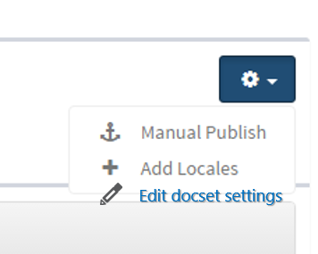
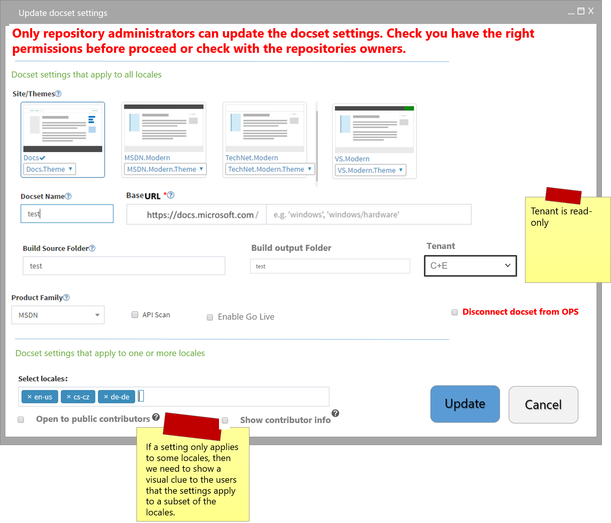

# Docset Property editing

***Status: DRAFT***

## Overview
A *docset group* is a group of English and localized docsets that share the same name, URL, as well as other common metadata. 

Users need to be able to make docset edits to one locale, all locales, or a subset of locales for a given *docset group*.  Having to do this for each locale is time consuming and very prone to error. 

It is important to note that some of the metadata applies to all the locales by default (for example, `base URL`), while others are locale specific (such as allow `external contributions`).

We also need to keep in mind that some of the metadata is now configurable in the portal and/or in the `.openpublishing.publish.config.json` file stored in the repo. 

Thus, this spec contains a full list of all the attributes a user can set as well as information about whether they can be applied at the locale level or they should be for all locales the same. Likewise, the metadata list will contain where the information is stored.

[This spreadsheet](https://microsoft.sharepoint.com/teams/Visual_Studio_China/MSDN/Shared%20Documents/Open%20Publishing/OPS_Metadata_DocsetEditing.xlsx?web=1) contains the information regarding the metadata and its attributes. 

## In scope
* Enable single or multi-locale edits on docset attributes.

## Out of scope
* Bulk edit of article properties or metadata or topic metadata that can be applied at the docset level. Example, ROBOTS.
* Repo attribute operations, such as repo renaming or deletion.
* OL specific attributes, such as includeDependencies.

## User experiences 
[This spreadsheet](https://microsoft.sharepoint.com/teams/Visual_Studio_China/MSDN/Shared%20Documents/Open%20Publishing/OPS_Metadata_DocsetEditing.xlsx?web=1) contains the information regarding the metadata and its attributes. 

### 1. User needs to edit docset attributes that apply to all locales
Permissions needed: Only repo admins can modify these settings. 
> [!NOTE]
> For going live or update URL once content is live, only VSC can do it.

Jamie needs to change the name of the docset. Jamie goes to the edit docset properties dialog and gives the docset a new name. OPS lets Jamie know that the changes apply to all the locales. Jamie clicks on update the settings for the docset. Jamie is happy to see that the docset is renamed for all the locales. 

### 2. User needs to edit docset attributes that apply to one or more locales
Permissions needed: Only repo admins can modify these settings.

Jamie would like to open her docset for external contributions. Jamie goes to the edit docset properties dialog and updates the setting. Jamie clicks on update the settings for the docset. Jamie is happy to see that the docset is renamed for all the locales.

### 3. Disconnecting a docset from OPS
Jamie would like to disconnects a docset from OPS. She understands from OPS portal that she needs admin permissions to all the locales as this happens for all the locales at once. She talks to Sonja and gets the appropriate permissions. Then, she disconnects the docset from OPS. OPS portal does not show the docset anymore and publishing information is no longer available.

## Roadmap
* P1 attributes - FY17Q2 committed
* P2 attributes - FY16Q2 proposed
* P3 attributes - FY16Q3 proposed

## Competitive Landscape
N/A

## Basic Design

### Editing docset settings
1. User selects the docset and clicks on the ***Settings**** button. Then selects ***Edit docset settings**. 
 

2. OPS reads the docset settings and shows those to the user.

3. User selects the appropriate settings. If the user is not an admin on the repo(s) where the docset(s) live, then 

4. User clicks on Save and OPS updates the docset settings for the given locales. If the user is not an admin on the repo, it will show the following error message:

`You need <needed_permission> to update the docset properties for the following repos. Contact the repo owner(s) to grant you the necessary permissions. Repos: <repo_name1>, <repo_name2>,...,<repo_name_n>.` 

