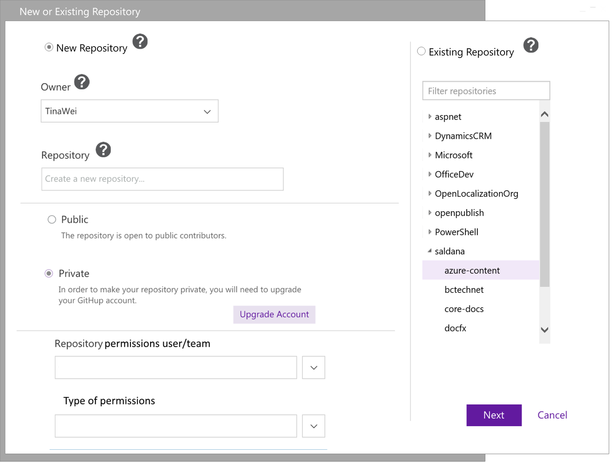
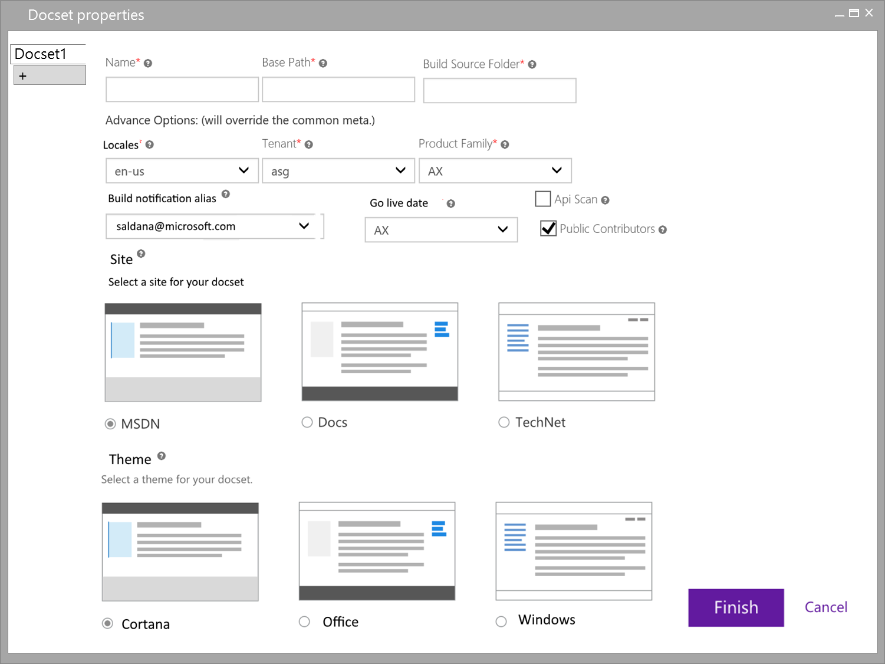
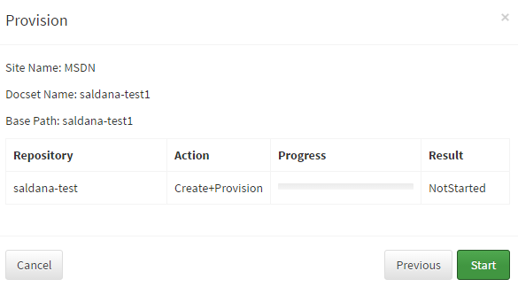
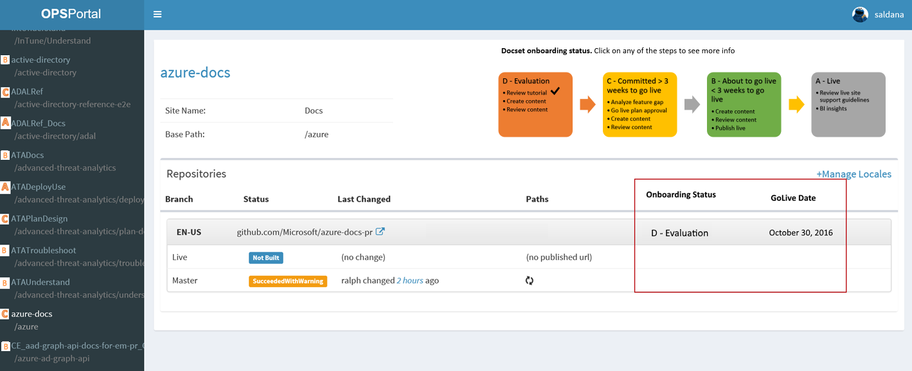
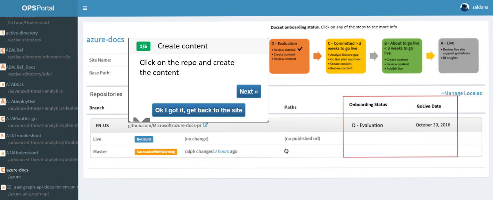
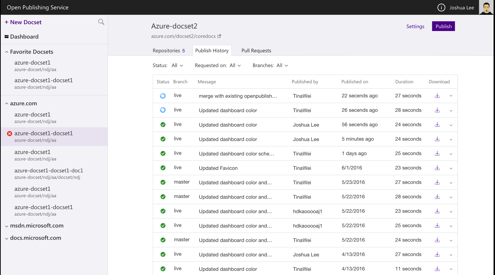

# Mini-spec – OP Self-service portal MVP 

##Overview
Today we are facing have two major problems that will be solved with the OPS self-service portal MVP (Minimum Viable Product):
1.	OPS engineering team is doing all the provisioning for partners. This is not scalable, provisioning steps are not streamlined. Thus, OPS engineering team spends resources doing this manual work instead of building a robust system or solving bigger problems.
2.	We have several resources where people can find information, most of them are disconnected: 2 OPs portals for provisioning, build publishing, and status, basic BI, user docs, and [SiteHelp portal](http://aka.ms/sitehelp) to log requests for our team. 

Therefore, we feel that we need to invest in a single self-service portal for OPS, called [http://OPS](http://OPS), to solve the problems above. We cannot guarantee that our partners would always read our documentation, have perfect knowledge of our system, or remember all our resources. We need to make the portal simple and intuitive so there’s less chance for misunderstanding or human errors.

##Goals 
1.	Make provisioning self-service for any of our endpoints. So any person can provision a repo/docset by itself regardless of their knowledge of Open Publishing Systems without any assistance. 
2.	Have a single portal that is self-service by containing the resources or having pointers to other resources partners and OPS team needs to do their daily job.
3.	Track where users are in the onboarding process.

##Non-goals for the MVP
1.	Self-onboarding to publish to third-party sites .
2.	Monitor OPS services health. 
3.	Allow users to edit and use their own templates. 

# Completed Scenarios
As a content owner, I can have an easy way to learn about OPS
*  P1 - I can have a tutorial when I enter in the site for the first time to get familiar with the portal and OPS.
* P2 - I can go through the tutorial as many times as I need.
* P2 - I can have basic contextual documentation in the portal
* P1 – As a user, I can go to the unified OPS portal by typing 

As a content owner, I have access to common OP resources
* P1 - I can have a link to detailed documentation.
* P1 – I can have a link to Yammer group.
* P1 – I can access OPS documentation from the portal when I am not in corpnet

As a content owner, I have a way to do self-provisioning
* P1 - I can have localized repos not connected to English repos.
* P1 - I can have multiple docsets in a repo publishing to different end points.
* P1 - I can create new docsets on a new repo, and the repo is created for me.
* P1 - I can create new docsets on existing repos.
* P2 - I can have localized repos in sync with English with regards to docsets. 

As a content owner, I have an easy way to log into the portal
* P1 - Portal is accessible via AAD, or 2-factor authentication when out of corpnet.
* P1 - I can have a separate sign off for GitHub and VSTS.

As a content owner, I can see and publish docsets.
* P1 - I have an easy way to see all my docsets.
* P1 - I can have an easy way to see the status and history of my publishing job.
* P1 - I can go to my repo from the portal.
* P2 - I can see all the published URLs for my content in the portal.	 * P2 - I can see all the publishing errors my content has (current and history).
* P2 – I can publish my docset for one or more languages.

##Roadmap

MVP (Minimum Viable Product) will be deliver to partners at the end of FY17 (S106)

##Competitive Landscape

N/A. 

##Basic Design

Design will continue to be built on top of the existing portal. Here are just some ideas for some of the components (not a workflow).

User selects whether to use an existing repo or create a new one.

Then, they add one or more docsets, and enter the main properties for the docset.
 

Once clicking on provisioning a status shows up.
 
 
Once the docsets are created, the system publishes the default branch and shows all the information in the portal together with the build status. Users can see, at all times, which stage they are at and what they would need to do to move to the next stage. 

 
Clicking on any of the steps would bring a tutorial with one or more steps to show user what they need to do. 

 
User can see the publishing history from the portal

If the user makes changes in his repo, he can see the history and status of the pull requests in the OPS portal

 
## Cost Estimate
N/A

## Open Issues/Risks
N/A
