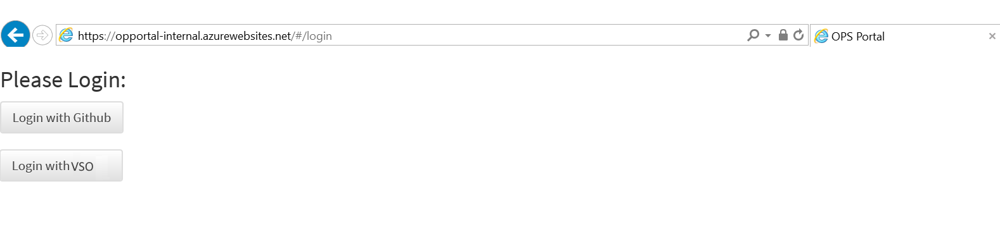
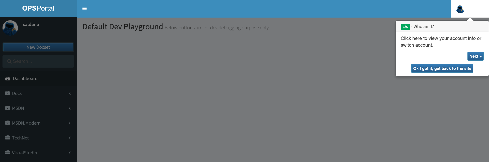
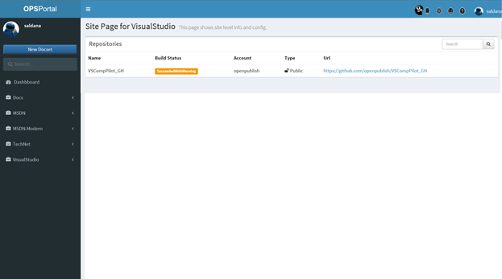
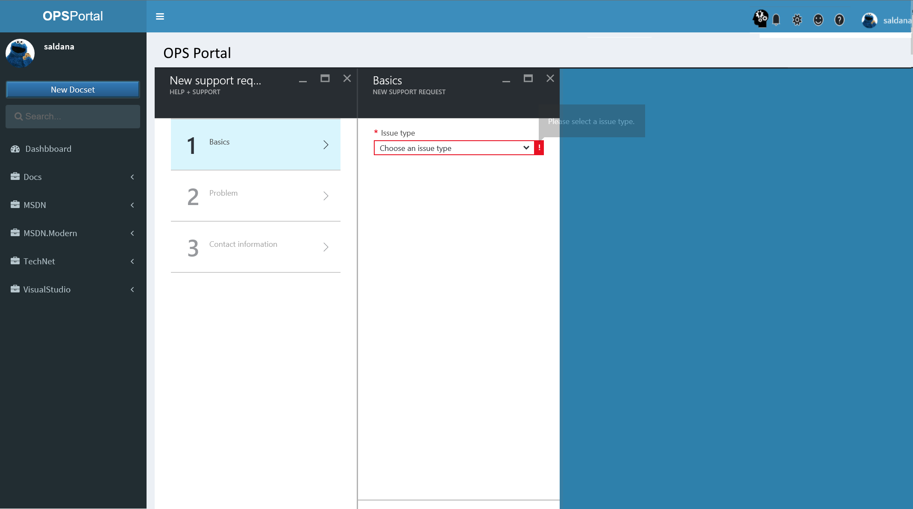
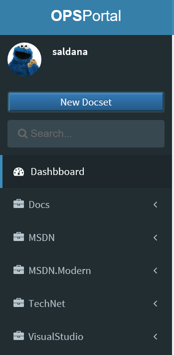
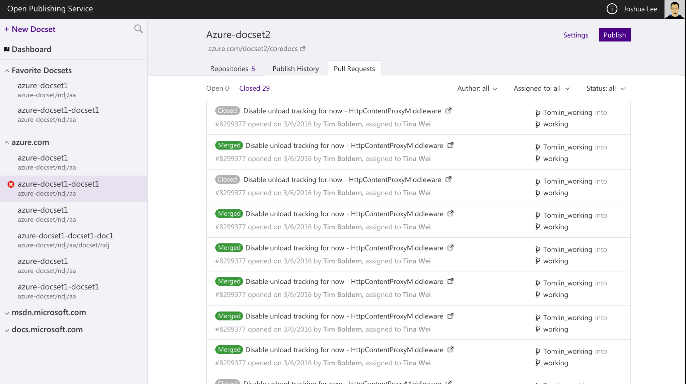
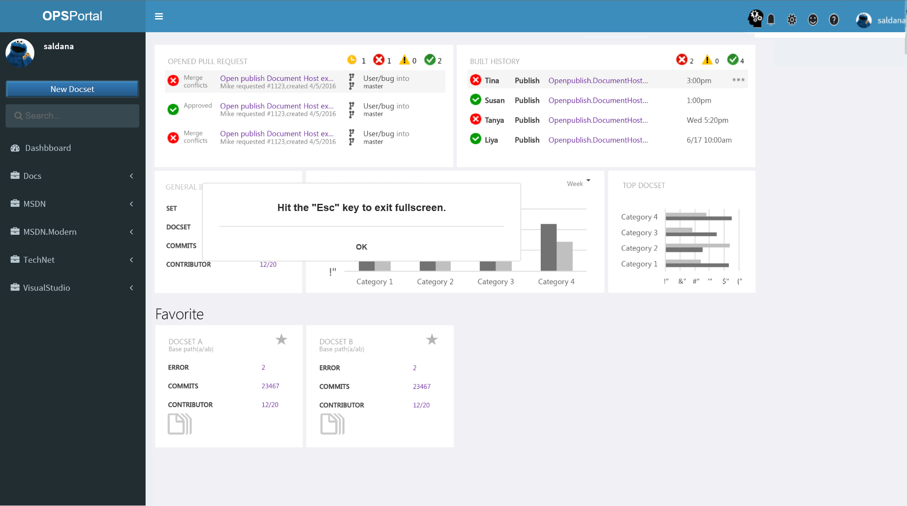

# One Pager – OP Self-service portal E2E

## Overview
Today we are facing have three major problems:
1.	OPS engineering team is doing all the provisioning for partners. This is not scalable, provisioning steps are not streamlined. Thus, OPS engineering team spends resources doing this manual work instead of building a robust system or solving bigger problems.
2.	We have several resources where people can find information, most of them are disconnected: 2 OPs portals for provisioning, build publishing, and status, basic BI, user docs, and [SiteHelp portal](http://aka.ms/sitehelp) to log to log requests for our team. 
3.	Partners have no visibility about their content till it renders. OP engineers do not have a way to check performance or system health.

Therefore, we feel that we need to invest in a single self-service portal for OPS, called [http://OPS](http://OPS), to solve the problems above. We cannot guarantee that our partners would always read our documentation, have perfect knowledge of our system, or remember all our resources. We need to make the portal simple and intuitive so there’s less chance for misunderstanding or human errors.

## Goals
1.	Make provisioning self-service for any of our endpoints. So any person can provision a repo/docset by itself regardless of their knowledge of Open Publishing Systems without any assistance. 
2.	Have a single portal that is self-service by containing the resources or having pointers to other resources partners and OPS team needs to do their daily job.
3.	Track where users are in the onboarding process.
4.	Monitor OPS services health. 
5.	Allow users to use existing templates or edit and use their own.

## Non-goals
1.	Self-onboarding to publish to third-party sites.

## Scenarios
### MVP
* P1 - As a content owner, I can have an easy way to learn about OPS in the portal.
* P1 - As a content owner, I have a single place to access all OP resources.
* P1 - As a content owner, I have a way to do self-provisioning for all locales.
* P2 - As a content owner, I have an easy way to log into the portal regardless where my repo is at (GitHub or VSTS Git).
* P2 - As a content owner, I can see and publish docsets, see build and other operation history and status.
 
### Post MVP (FY17 Q2 candidates)
* P2 - I can set up configuration for syncing between repos in the portal for English and loc from public to private and vice-versa
  * Consider the case where the repos are not named the same, for example, Chinese for Mooncake or BlackForest. 
* P2 - I can add same permissions to my localized repos upon provisioning
*	P2 - I can make “bulk edits” for single or multi-locale.
  
    * point to public repo and branch 
      ```
      "git_repository_url_open_to_public_contributors": "https://github.com/Microsoft/ATADocs.de-de",
      "git_repository_branch_open_to_public_contributors": "live",
      ```
    * builds notification
    * accept contributions
    * working branches for loc
    * merge from master to live branch

* P2 - I can delete a docset for all locales (we do not support for a single locale at this point)
* P2 - I can provisioning docsets for different versions (dependent on Xiaokai's versioning spec)
* P2 - As a content owner or engineering team member I can see where a particular project is with regards to onboarding to OP.
* P2 - I can have the look and feel of Azure portal
* P2 - I can have telemetry in the portal
* P3 - I can save user preferences in the portal
  * Favorite docsets for example
* P3 – As a localization owner, I can see the localization status of my content. (maybe for Q2, reading the localized reports. Albina has already done this)
* P3 - As an OPS engineer I can have track the lifecycle of the content in the portal. (Sandesh Scenarios)

### Post MVP (FY17 Q3 and beyond, not sorted in any particular order)
* P2 - I can create offline books in OPS portal.
  *  Dependent on Hui's API work: https://mseng.visualstudio.com/VSChina/_workitems?id=641246&_a=edit. Target sprint S109 for delivery to partner in S110.
  *  CSI said that having this as a self-service is a nice to have
* P3 - I can have the same look and feel in the OPS documentation than in the portal
* P2 - I can see a tutorial when new functionality is added to the portal or UI changes. 

As a user, I have access to common OP resources.
*	P2 - I can file requests to log requests for our team from the portal. 
*	P3 - I can integrate my own dashboards in the OP portal, such as from SkyEye.

As a content owner, I have a way to do self-provisioning.

*	P3 - I can remove a locale from OP.
*	P2 - I can have OL hookup to my localized repos when provisioning. This might be done via iCMS according to Jackie and Zhen. 

As a content owner, I have an easy way to log into the portal
*	P2 - I can have an aggregated view for both GitHub and VSTS repos.

As a content owner, I can see and publish docsets. 
*	P3 - I can see my docsets grouped by repo. 
*	P2 - I can have access to notifications.
*	P3 - I can configure some portal settings: tutorial, views, etc.
*   P2 - Links to standard templates built by Rome's team
*   P2 - Links to OP tools repo: https://github.com/Microsoft/OpenPublishing-Tools  
* Migration tool
* P3 - I can add bilingual setting to multiple localized repos. This is controlled in docfx.json file: metadata_type = “hover over” 

P3 - For the localization portal: http://olapi-sandbox.azurewebsites.net/Portal/advanced.html
 * Have a link to from the OPS portal
 * Think about moving this portal to the OPS domain

## Roadmap
We will implement this portal in waves:
* FY17Q1 - Wave 1 – Minimum Viable Product (MVP). Focus is P1 scenarios for self-provisioning and basic functionality on the portal for new users.
* FY17Q2 - Wave 2 – Incremental core functionality built by sprint based on customer feedback, this One Pager, and related specs.
* FY17Q3 and beyond – Wave 3 – New, incremental, or new functionality based on customer feedback, this One Pager, and related specs. 

## Competitive Landscape
N/A. We do not have a direct competitor. Some design ideas about how others are solving some of these problems are in the spec. 

## Basic Design
This design is just a set of concepts to illustrate graphically the workflow, and not the recommended design. 

User Signs in into the portal with either GitHub or VSTS account



If the user is new or there is new functionality, user sees a tutorial



Regardless where the user is at in the portal, they always see common elements



The left nav pane shows a search box, a button to create a new docset, and the docsets grouped by end point. Expanding it shows the docsets and base URLs linked to that end point.

The top bar shows a link to main elements like:
1.	Link to OPS dashboard
2.	Site notification
3.	Site settings/options
4.	Easy way to log a request to our team.
5.	Access to OP documentation
6.	User info. Sign in and sign out options.  

The issue tracking system is integrated in the portal. If the user has their content live already, it will create a live site issue by default. 
 


When the user is ready to create a new docset, they click on the “New docset” on the left nav.



A guided assistance appears. User selects whether to use an existing repo or create a new one.


Then, they add one or more docsets, and enter the main properties for the docset.


Once clicking on provisioning a status shows up. 


Once the docsets are created, the system publishes the default branch and shows all the information in the portal together with the build status. Users can see, at all times, which stage they are at and what they would need to do to move to the next stage. 


Clicking on any of the steps would bring a tutorial with one or more steps to show user what they need to do. 


User can see the publishing history from the portal


If the user makes changes in his repo, he can see the history and status of the pull requests in the OPS portal



Once the user has docsets provisioning, they can see different dashboards in the home page, including build and pull request status, build history, BI dashboard, and more.

 

Other dashboard examples
We can use dashboards to track the overall onboarding status or other BI data. Here is an [example](https://msit.powerbi.com/groups/me/dashboards/68409e64-0219-4a9c-8d34-19c9a2114d90). 

## Cost Estimate
N/A
## Open Issues/Risks
Open Issue/Risk	| Description |	Owner
--- | --- | ---


