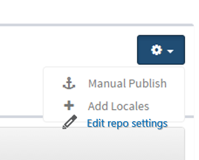
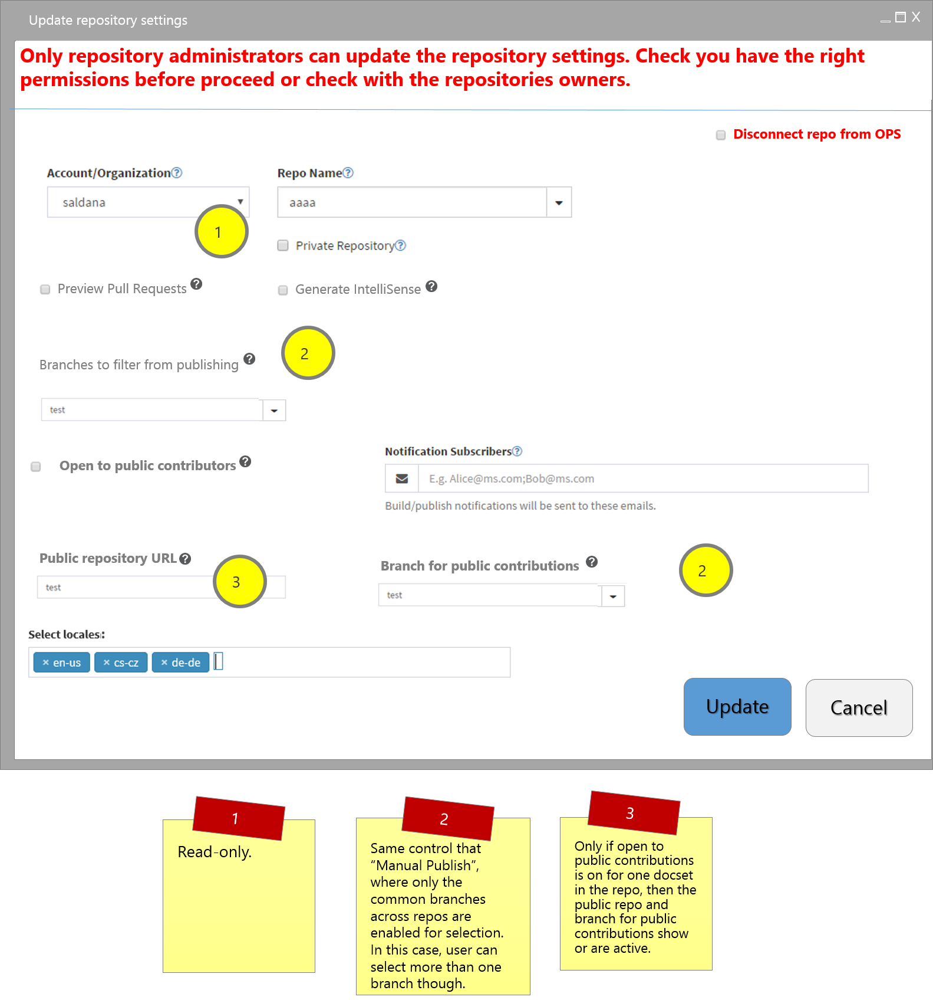

# Repo Property editing

***Status: DRAFT***

## Overview
Users need to be able to make repo edits to one or multiplerepos that are linked together (usually English and localizaion).  

We also need to keep in mind that some of the metadata is now configurable in the portal and/or in the `.openpublishing.publish.config.json` file stored in the repo. 

Thus, this spec contains a full list of all the attributes a user can set as well as information about whether they can be applied at single repo or multi-repo 

[This spreadsheet](https://microsoft.sharepoint.com/teams/Visual_Studio_China/MSDN/Shared%20Documents/Open%20Publishing/OPS_Metadata_DocsetEditing.xlsx?web=1) contains the information regarding the metadata and its attributes. 

## In scope
* Enable single or multiple repo property edits. Repos need to be linked to each other (e.g., English and localization).

## Out of scope
* Bulk edit of article properties or metadata or topic metadata that can be applied at the docset level. Example, ROBOTS.
* Docset attribute operations, such as docset renaming or deletion.
* OL specific attributes, such as includeDependencies.

## Scenarios
[This spreadsheet](https://microsoft.sharepoint.com/teams/Visual_Studio_China/MSDN/Shared%20Documents/Open%20Publishing/OPS_Metadata_DocsetEditing.xlsx?web=1) contains the information regarding the metadata and its attributes. 

### User needs to edit repo attributes to one or more repos
Permissions needed: Only admins on the repo(s) can modify these settings. 

1. User clicks on update the settings for the repo where a docset lives.
2. OPS reads the repo settings and shows those to the user.
3. User makes settings changes.
4. User select the locales where to make those changes.
4. Once clicking submit, OPS updates the repo attributes for all repos selected. 

Permissions needed: Only repo admins can modify these settings.

Jamie would like to open her docset for external contributions. Jamie goes to the edit docset properties dialog and updates the setting. Jamie clicks on update the settings for the docset. Jamie is happy to see that the docset is renamed for all the locales.

### 3. Disconnecting a repo from OPS
`this happens at the locale level, i.e., not all the locales are disconnected from OPS, unless user selects them all.` 

Jamie would like to disconnects a repo from OPS. She understands from OPS portal that she needs admin permissions to the repo she wants to disconnect. She also understands that this will happen for all docsets that repo has connected to OPS. She goes to the portal and disconnects the repo from OPS. OPS portal does not show any of the docsets that were in that repo anymore and publishing information for any of those docsets is no longer available.

## Roadmap
FY17Q2

## Competitive Landscape
N/A

## Basic Design
1. User selects the docset and clicks on the ***Settings**** button.  Then selects ***Edit repo settings**.

2. User selects the appropriate settings

3. User clicks on Save and OPS updates the repo settings for the given repos. If the user is not an admin on the repo, it will show the following error message:

`You need <needed_permission> to update the docset properties for the following repos. Contact the repo owner(s) to grant you the necessary permissions. Repos: <repo_name1>, <repo_name2>,...,<repo_name_n>.` 
