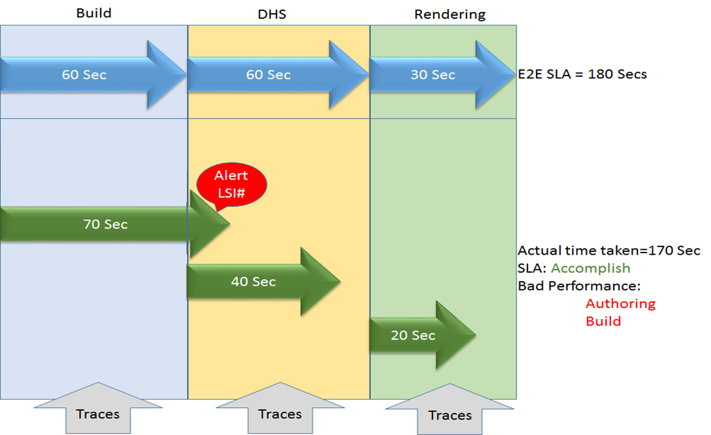
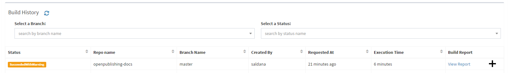
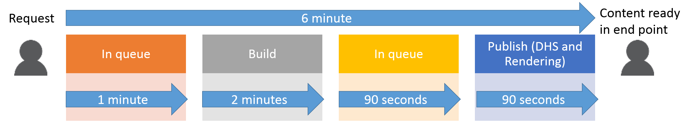

# Displaying OPS System Health in OPS portal
*A lot of the below is taken from OPS Content tracking system.docx initial requirement spec by Sandesh Moghe*

## Overview

### Potential customers
* Content publishers and developers (Partners/Customers)
* OP Developers (Engineering Teams)
* Operations team

### Customers’ Key tasks
* Publish content
* Develop OP services
* Service delivery, monitoring and performance.

### Customers’ major problems and impacting behaviors
* Partners have no visibility about their content till it renders. We believe that content publishers don’t have tool to find out at what stage their content is on.
* OPS Developers don’t have tool to check the performance at each stage of the publishing.
* OPS Operations team don’t have easy way to
    * Setup SLA for publishing content for partners
    * Monitor performance 
    * Troubleshoot if customers escalate for specific content

## Goals
* Showcase in the portal status of OPS health for all our potential customers

***Short term***: To track each main step and how long each takes, including contet in queue.

***Medium term***: To add LSIs for each of the step as traces. When a step is outside LSA, automatically log an LSI. Example> 

***Long term***: To break down each step further doww, such as build and publishing with telemetry for each step.

## Non-goals
N/A

## Scenarios
### I can see how long build and publishing take for each of the major phases
Jamie would like to see how long a build is taking for each of the steps and how long the build is in queue between the steps. She can see that for each of the builds in her docset in the portal and see a comparison to the given SLA.

* Request
* Build
* Publish (DHS and Rendering)

## Roadmap
* We will start in S108 with the first and more basic work.
* We will reserve time in each sprint to keep adding scenarios for both partners and VSC. How fast we go depends on which data we need and whether it is already available or we need to generate it.

## Competitive Landscape
N/A. We do not have a direct competitor. Some design ideas about how others are solving some of these problems are in the spec. 

## Basic Design
***S108***

Target user: Content partners and Operations
1. User goes to the portal and look at one of the builds.
2. For one particular build, she clicks on the + sign to see more information.

    

3. OPS portal will show a break down of the time spent in each of the main phases.

