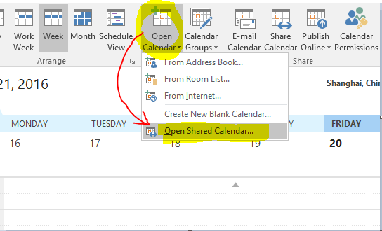
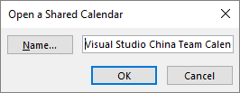
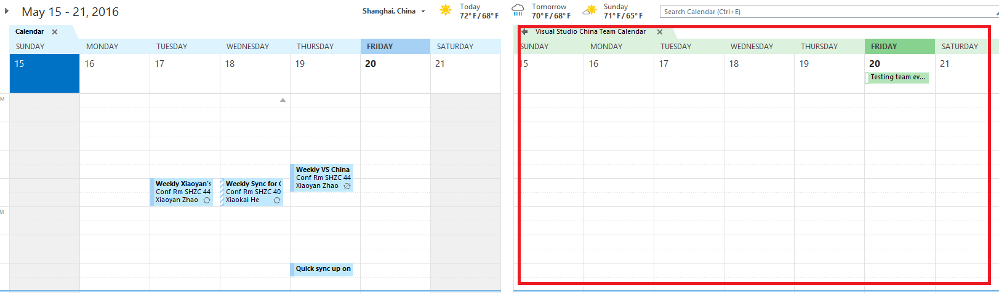
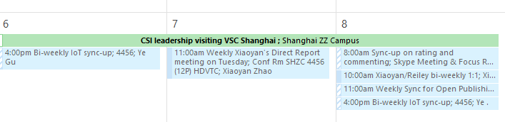

# Support

This topic provides information regarding how APEX team provides support on the services that APEX works on.

## SiteHelp

With Sprint S116, we have released *SiteHelp* [(http://aka.ms/sitehelp)](http://aka.ms/sitehelp) to make sure that we make it easier for you to log requests and for our team to provide a faster response. 

The site has search functionality so you can look for an existing issue or to see if your request has already been entered. We encourage you to use search before logging any request to see if it has been logged by somebody else already. 

If you need to report a new issue, note that now we use the same form for all the requests, so you do not have to worry about the distinction between live site issues and bugs. Our team will do the triage and routing as necessary. You can use *SiteHelp* [(http://aka.ms/sitehelp)](http://aka.ms/sitehelp) to log issues related to:
* docs.microsoft.com
* review.docs.microsoft.com
* developer.microsoft.com
* any part of MSDN, Technet or VSCom
* when authoring or publishing content to any of the sites above
* using internal tools

Additionally, you can also use it to make feature requests.

You can report issues or ask for improvements for SiteHelp using either [SiteHelp](http://aka.ms/sitehelp).

## SiteHelp service mapping
Here is a mapping of the options in [SiteHelp](http://aka.ms/sitehelp) with our existing services. If the service you are looking for is not there, please go to [MSDNHelp](https://msdnhelp.corp.microsoft.com/). If you still cannot find it, please [email us](mailto:guangw@microsoft.com;saldana@microsoft.com?subject=[Site%20Help%20and%20MSDNHelp%20Portasl%20Missing%20Service]).

### Pre-production issues
Issues that have in the internal sites (review or staging) on any of our sites

|SiteHelp option |Services covered |Triaged by|
|----------------|-----------------|----------|
|1. on the site of review.docs.microsoft.com| docs.microsoft.com Ratings, Commenting & Side Notes|Duncan Mackenzie's team|
|2. trying to author/publish content for review.docs.microsoft.com|OPS OL Ratings, Commenting & Side Notes Gauntlet Offline books|Martin O'Flaherty/Zhen Jiao's team|
|3. staging environment for MSDN or TechNet or VS.com|MSDN, TechNet, VS.com|Zhen Jiao's team|

### Production 
Issues happening on the live environments or on the live services. 

|SiteHelp option |Services covered |Triaged by|
|----------------|-----------------|----------|
|4. on the site of docs.microsoft.com| docs.microsoft.com Ratings, Commenting & Side Notes|Guang-an Wu's team|
|5. on the site of developer.microsoft.com|developer.msft.com|Guang-an Wu's team|
|6. on any site of MSDN, TechNet, or VS.com|MSDN/TechNet Blogs MSDN/TechNet Forums MSDN Profile (social.msdn.microsoft.com/profile/) MSDN Search (social.msdn.microsoft.com/search/) MSDN, TechNet, or Visual Studio Gallery MSDN, TechNet, or VS.com Site Rendering|Guang-an Wu's team|
|7. trying to author/publish content for any site|OPS OL Gauntlet Offline books Docs' site-level redirections Request a new locale for docs  CAPS CAPS migration MTPS (Database)|Guang-an Wu's team|

### Others
Feature requests or issues with internal tools.

|SiteHelp option |Services covered |Triaged by|
|----------------|-----------------|----------|
|8. making a new feature request to any site of service|All services|Dan Fernandez's online PM team|
|9. using internal tools|AirLoc CATS/ContentQA LEGO SiteHelp|Sandra Aldana|

### Triaging process
The team members listed above will do the first triage of the requests logged. This includes:
1. Ensure that right category has been picked by the user. If not, they will reroute. In many cases, we will see items logged as production to be moved to non-production.
2. Ensure the right urgency is correct. If not, they will adjust accordingly.
3. The team assigned the request then will follow up accordingly with the user. In the case of production issues, team will follow the [production SLA](sla.md#SLAProduction).

## MSDNHelp

We have removed from [MSDNHelp](https://msdnhelp.corp.microsoft.com/) some of the existing functionality in [SiteHelp](http://aka.ms/sitehelp) so there are not two different places to log the requests. You can still use [MSDNHelp](https://msdnhelp.corp.microsoft.com/) for:
* Hub and Landing Pages
* Other support not listes above, such as MTPS redirects
* PT! and SMS Content Updates
* Azure content bugs

## Sprint cycle and service deployment
Sprints are 3 weeks long starting on a Monday and finishing on a Friday. The deployment happens during the first week of the next sprint.

Our spring schedule and service deployment information is available in our team calendar. Note this is not limited to just Open Publishing but for all services that VSC supports. You can easily integrate the team calendar into Outlook by following the below steps.

1. In Outlook Calendar view, click **Open Calendar** -> **Open Shared Calendar**.

    

2. Type “Visual Studio China Team Calendar” (alias: vsctc), then click **Ok**.

    

3. Now you should see the team calendar shows side by side with your personal calendar.

    

4. Alternatively, right click on the **Overlay** option to switch to the overlay view.

    

    

## Tips for better bug tracking
1. Install and set up [Bugger](http://toolbox/bugger).
    * It will show you a small notification area with the bugs assigned to you.
2. Notify a team member with @mention control
    * Use @<MS_alias> in a VSTS work item converstaion to have VSTS sending a mail to that person. That way, you have a centralized place to have a conversation with different team members that is easy to share. 
    * See [Alert a team member about a change](https://www.visualstudio.com/en-us/docs/work/productivity/productivity-tips#mention-person-id) for more information.   
3. Follow an item and get instant mail notifications each time it is saved
    * See [Follow a work item](https://www.visualstudio.com/en-us/docs/work/productivity/productivity-tips#follow-a-work-item) for more information.

## Getting access to VSTS mseng
All FTEs have default read/write access to the VSTS MSENG. Permission for vendors are managed by Ramweb. Here are the instructions:

* For Feature and Work Item Access, please request [project ID 10073 access](https://ramweb/requestaccess.aspx?ProjectID=10073)
* For Source Code Access, please request [project ID 11461 access](https://ramweb/requestAccess.aspx?ProjectID=11461)  

More information about access and related details/issues: [VSAccess](http://vsaccess)
