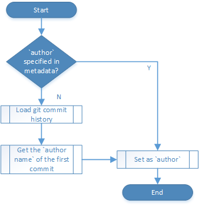

# OPS metadata generated in DocFX plugins

Some OPS metadata are generated by build service in DocFX plugins, such as `author`, `document_id`, `updated_at`, etc. The plugins also generate internal data (with prefix `_op_`) into raw model which will be used template to show on page, such as `_op_gitContributorInformation`.

## Contributor information: `author`, contributor, `updated_at`
### Resolve of `author` and contributor
#### with Git user profile
There are 2 cases where we need to resolve user profile,

  1. this is a GitHub repo,
  2. this is a VSO repo, but user specified `resolve_user_profile_using_github` in current branch's publishing configuration.

* Resolve `author` with user profile

* Resolve contributors with user profile

The user profile cache is constructed by two parts:
  1. Local user profile map stored in build cache `history` folder.
  2. Global user profile cache stored in Azure table `GitHubUserProfileTableEntity`.
  3. Global user profile cache takes precedence of local user profile map.
  4. Both local user profile map and global user profile cache get updated after DocFX plugins.

#### without Git user profile
* Resolve `author` without user profile

* Resolve contributors without user profile

### Resolve of `updated_at`
`updated_at` is the time the last commit of the file pushed into current branch. This info is recorded in build cache `history` folder by `GitContributorInformationResolver` console, and queried out in DocFX plugin.

Note this metadata is different from what is shown on page `Updated at:`. The time shown on the page is defined as

1. If user specified `update_date` in metadata, use `update_date`.
2. Otherwise, use the value of `updated_at`.

### Special logic for reference docs
1. For reference docs, it barely makes sense to use `author` extracted from Git history. As a result, it is required to set `author` in user metadata (usually using a robot account).
2. Contributor list is generated, but currently no reference template is showing it.
3. If reference doc has overwrite docs, `updated_at` is most recent value among reference doc itself and all its overwrite docs.

## Git URLs
Following Git URLs are resolved and set:

| Metadata | Meaning | Example |
| -------- | ------- | ------- |
| `content_git_url` | The Git URL to the file to contribute. It could be different from `original_content_git_url` if user specify `git_repository_url_open_to_public_contributors` or `git_repository_branch_open_to_public_contributors` in publishing config.  Applicable to conceptual doc only. | https://github.com/Microsoft/azure-docs/blob/master/articles/networking/networking-overview.md |
| `original_content_git_url` | The Git URL to the file in the repo/branch where the page is published from.  For reference docs, this is the URL to the overwrite doc. | https://github.com/Microsoft/azure-docs-pr/blob/live/articles/networking/networking-overview.md |
| `gitcommit` | The Git URL to the version (commit) of the file that the page is published from. | https://github.com/Microsoft/azure-docs-pr/blob/853821989c4243b4320eddf2b29db4a7cb687c73/articles/networking/networking-overview.md |
| `original_ref_skeleton_git_url` | The Git URL to the yml file in the repo/branch where the page is published from.  Applicable to reference doc only. | https://github.com/Microsoft/openpublishing-test/blob/master/openpublishing/test/reference/System.Action.yml |
| `ref_skeleton_gitcommit` | The Git URL to the version (commit) of the yml file that the page is published from.  Applicable to reference doc only. | https://github.com/Microsoft/openpublishing-test/blob/70e33c8f94e2cda6ebe2584ac5f13d44f19911d6/openpublishing/test/reference/System.Action.yml |
 
## document_id
See [metadata document](..\partnerdocs\metadata.md#21-unique-identifier-for-a-content).
