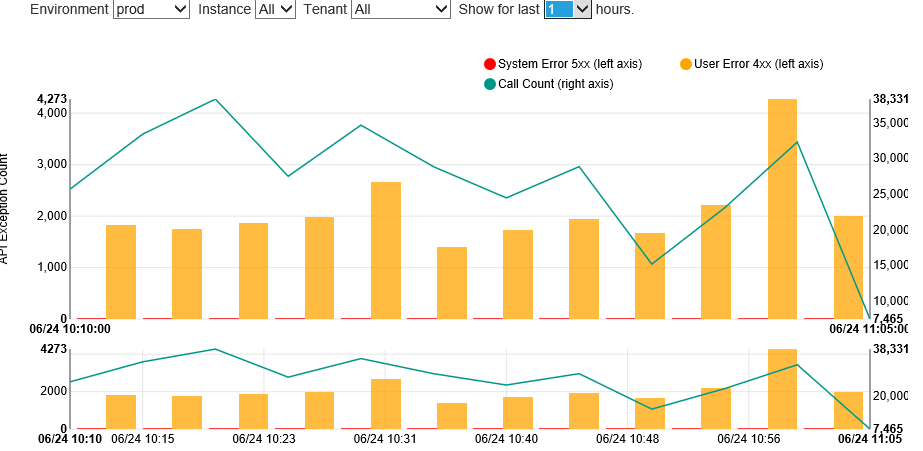

#Average Response Time GreaterThan 10 (Seconds) in the last 5 minutes#
----------------------------------------------------------------------------------

#1.Check Environment
If it is from sandbox environment (SUBSCRIPTION NAME: Open Publishing - DHS Sandbox),  vscsdses@microsoft.com via email only. No more action is required for T1 support.Team will investigate in business hour
#2.Check Service Impact

a.Hit page https://msdn.microsoft.com/en-us/powershell/dsc/overview and https://developer.microsoft.com/en-us/for 5 times.

b.If page cannot be loaded for any time, go to Contact SE DRI step directly.

c.If page can always be loaded, and load time is within 5 seconds for at least 3 times, no more action is required for tier1 support. Dev team will investigate in business hour. 

d.Otherwise,follow the below steps.

#3.Check for RESOLVED alert mail

a.Search in mail box for a companion alert beginning with [ALERT RESOLVED].

b.If the titles match, it means the issue is self-healed. No more action is required for tier1 support. Dev team will investigate in business hour. 

c.If no such mail is received, follow the below steps. 

#4.Check service dashboard

a.Go to http://capsinsight.azurewebsites.net/Charts/APIException2.aspx?env=prod&comp=Microsoft.Document.Hosting.WebApi and view the API Error graph. 

b.Switch to prod environment and last 1 hour's view.

c.Check API Error chart. If average warning / error rate for the last 5 minutes goes down under 3 per minute, and page https://msdn.microsoft.com/en-us/powershell/dsc/overview can be loaded in 5 seconds, no more action is required for T1 support.

d.Otherwise, follow the below steps.

#5.Contact SE DRI to make sure is not infrastructure or Capacity issues.

a.Make sure no [ALERT RESOLVED] mail is received again.

b.Call [VSCSDSES DRI](https://icm.ad.msft.net/imp/CurrentOnCall.aspx?teamId=23037&tenantId=20342&incdep=0&incvirt=1&mode=oneshift)

c.If it is code or service issue, follow below steps

#6.Contact Dev DRI

a.Make sure no [ALERT RESOLVED] mail is received again.

b.Find current DRI of Open Publishing - DHS [here](https://icm.ad.msft.net/imp/FutureOnCallSchedule.aspx?teamId=26676)

c.Try primary then secondary. Try Skype for Business then Phone. Try work phone then mobile phone. 
